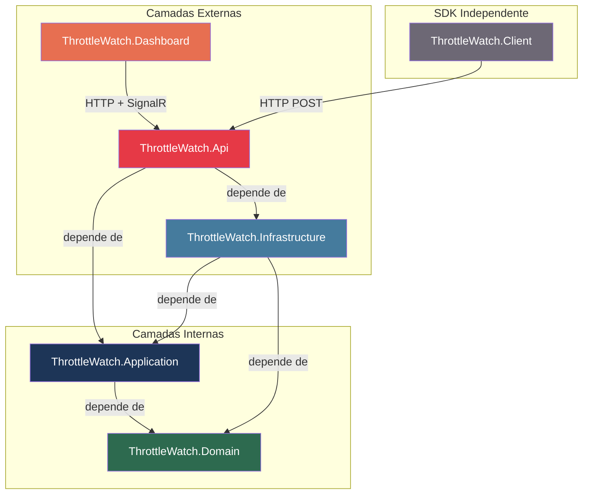
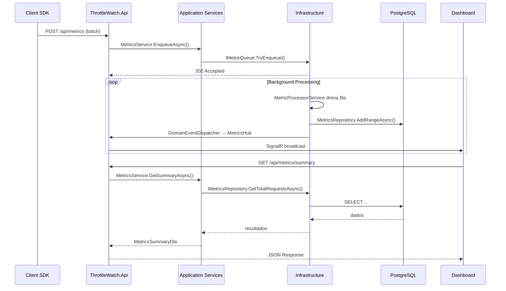

# ThrottleWatch — Documento Oficial de Arquitetura

**Versão:** 1.0  
**Status:** Definitivo  
**Última atualização:** Julho 2026

> Este documento é a única fonte de verdade para todas as decisões arquiteturais do projeto.  
> Nenhuma implementação deverá contradizer o que está definido aqui.  
> Toda dúvida sobre onde colocar um arquivo, classe ou interface deve ser respondida por este documento.

---

## Sumário

1. [Visão Geral](#1-visão-geral)
2. [Arquitetura](#2-arquitetura)
3. [Estrutura da Solution](#3-estrutura-da-solution)
4. [Projetos](#4-projetos)
5. [Organização das Pastas](#5-organização-das-pastas)
6. [Fluxo entre Camadas](#6-fluxo-entre-camadas)
7. [Regras Arquiteturais](#7-regras-arquiteturais)
8. [Convenções de Nomenclatura](#8-convenções-de-nomenclatura)
9. [Tecnologias](#9-tecnologias)
10. [Decisões Arquiteturais (ADRs)](#10-decisões-arquiteturais-adrs)
11. [Restrições](#11-restrições)
12. [Evolução](#12-evolução)

---

## 1. Visão Geral

### Descrição

ThrottleWatch é uma plataforma open source de observabilidade focada em monitoramento de rate limiting para aplicações ASP.NET Core. Permite que equipes visualizem em tempo real quais endpoints estão sendo throttled, quais clientes estão sendo bloqueados, e quais políticas de rate limiting estão configuradas.

### Objetivos

- Capturar eventos de rate limiting de aplicações ASP.NET Core via SDK (ThrottleWatch.Client)
- Processar e persistir métricas de forma eficiente e não bloqueante
- Disponibilizar uma API REST para consulta e gerenciamento
- Exibir dados em tempo real via Dashboard Blazor + SignalR
- Disparar alertas com base em regras configuráveis
- Gerar insights automáticos sobre padrões de bloqueio

### Escopo

**Dentro do escopo:**
- SDK de coleta de métricas (middleware ASP.NET Core)
- API de ingestão e consulta de métricas
- Sistema de alertas configuráveis
- Engine de geração de insights
- Dashboard de monitoramento em tempo real
- API REST completa com documentação

**Fora do escopo:**
- Gerenciamento das políticas de rate limiting (responsabilidade da aplicação consumidora)
- Autenticação da aplicação consumidora (gerenciada externamente)
- Integração com brokers de mensagem (Kafka, RabbitMQ)
- Deploy automatizado (CI/CD não faz parte do escopo de desenvolvimento)

---

## 2. Arquitetura

### Arquitetura Utilizada

**Clean Architecture** — Robert C. Martin.

Essa decisão é definitiva e irreversível. Nenhuma outra arquitetura deve ser introduzida, combinada ou sugerida.

### Modelo de Aplicação

**Monólito** implantado como uma única unidade. Todos os projetos compilam e são executados dentro de um único processo (exceto o ThrottleWatch.Client, que é um SDK independente instalado em aplicações externas).

### Princípios Adotados

- **Regra de Dependência:** As dependências apontam sempre para dentro. Camadas internas não conhecem camadas externas.
- **Separação de Responsabilidades:** Cada projeto tem uma responsabilidade única e bem definida.
- **Inversão de Dependência:** Camadas externas implementam interfaces definidas pelas camadas internas.
- **Independência de Framework:** O Domain não depende de nenhum framework ou biblioteca externa.
- **Independência de Banco de Dados:** O Domain e a Application não conhecem EF Core, SQL ou PostgreSQL.
- **Testabilidade:** Todas as camadas internas são testáveis sem infraestrutura externa.

### Camadas (de dentro para fora)

```
┌─────────────────────────────────────────────┐
│                  Domain                      │  Regras de negócio puras
│   Entities · Enums · Interfaces · Events    │  Zero dependências externas
└───────────────────┬─────────────────────────┘
                    │  ▲
                    │  depende de
                    ▼
┌─────────────────────────────────────────────┐
│                Application                   │  Casos de uso
│   Services · DTOs · Interfaces · Validators │  Depende apenas do Domain
└───────────────────┬─────────────────────────┘
                    │  ▲
                    │  depende de
                    ▼
┌─────────────────────────────────────────────┐
│               Infrastructure                 │  Implementações concretas
│   EF Core · Repositories · Queue · Jobs     │  Depende de Application e Domain
└───────────────────┬─────────────────────────┘
                    │  ▲
                    │  depende de
                    ▼
┌─────────────────────────────────────────────┐
│              Api  /  Dashboard               │  Ponto de entrada
│   Endpoints · Hubs · Middleware · DI        │  Depende de Application e Infrastructure
└─────────────────────────────────────────────┘

┌─────────────────────────────────────────────┐
│                  Client                      │  SDK independente
│   Middleware · HttpClient · Configuration   │  Zero dependência de outros projetos TW
└─────────────────────────────────────────────┘
```

### Diagrama Mermaid



---

## 3. Estrutura da Solution

```
ThrottleWatch/
├── ThrottleWatch.slnx               # Arquivo da Solution
├── Directory.Build.props            # Propriedades comuns de build (TargetFramework, Nullable, etc.)
├── global.json                      # Versão do SDK .NET fixada
├── ARCHITECTURE.md                  # Este documento
├── DEVELOPMENT_GUIDE.md             # Guia de desenvolvimento e contribuição
├── README.md                        # Visão geral pública do projeto
├── .gitignore
│
├── src/
│   ├── ThrottleWatch.Domain/        # Camada de domínio
│   ├── ThrottleWatch.Application/   # Camada de aplicação (casos de uso)
│   ├── ThrottleWatch.Infrastructure/# Camada de infraestrutura
│   ├── ThrottleWatch.Api/           # API REST + SignalR (ponto de entrada principal)
│   ├── ThrottleWatch.Dashboard/     # Dashboard Blazor
│   └── ThrottleWatch.Client/        # SDK para aplicações consumidoras
│
├── tests/
│   ├── ThrottleWatch.Domain.Tests/
│   ├── ThrottleWatch.Application.Tests/
│   ├── ThrottleWatch.Infrastructure.Tests/
│   └── ThrottleWatch.Api.Tests/
│
└── docs/
    └── (documentação interna, não commitada)
```

---

## 4. Projetos

---

### ThrottleWatch.Domain

**Objetivo:** Conter toda a lógica de negócio pura do sistema. É o núcleo da aplicação. Não conhece nenhuma camada externa.

**Responsabilidades:**
- Definir as entidades de domínio com suas invariantes
- Definir os enums que representam estados do domínio
- Definir as interfaces de repositório (contratos)
- Definir os eventos de domínio
- Definir a hierarquia de exceções de domínio

**Pode conter:**
- Classes abstratas e concretas de entidades (`Entity`, `MetricEntry`, `AlertRule`, `AlertEvent`, `Insight`)
- Enums (`AlertSeverity`, `InsightType`, `ThrottleStatus`)
- Interfaces de repositório (`IMetricsRepository`, `IAlertRepository`, `IInsightRepository`)
- Interface de evento de domínio (`IDomainEvent`)
- Records de eventos de domínio (`MetricRecordedEvent`, `AlertTriggeredEvent`, `InsightGeneratedEvent`)
- Exceções de domínio (`DomainException` e subclasses)
- Factory methods nas próprias entidades
- Métodos de comportamento nas entidades (`CanTrigger`, `Acknowledge`, `Dismiss`)

**NÃO pode conter:**
- Referência a qualquer pacote NuGet externo
- Referência a EF Core, Dapper ou qualquer ORM
- Referência a ASP.NET Core
- Referência a MediatR, FluentValidation ou qualquer framework
- DTOs, ViewModels ou objetos de transferência de dados
- Lógica de aplicação (orquestração de casos de uso)
- Lógica de infraestrutura (queries SQL, acesso a disco, HTTP)
- Value Objects criados apenas para encapsular primitivos simples

**Dependências permitidas:**
- Nenhuma. Zero referências a pacotes externos.

**Dependências proibidas:**
- Qualquer pacote NuGet
- Referência a outros projetos ThrottleWatch

---

### ThrottleWatch.Application

**Objetivo:** Orquestrar os casos de uso da aplicação. Conhece o Domain e define interfaces para o que a Infrastructure deve implementar.

**Responsabilidades:**
- Implementar os serviços de aplicação que executam os casos de uso
- Definir DTOs para entrada e saída de dados
- Definir interfaces de serviços externos necessários (ports)
- Validar dados de entrada usando FluentValidation
- Coordenar operações entre repositórios e outros serviços

**Pode conter:**
- Interfaces de serviço (`IMetricsService`, `IAlertService`, `IInsightService`)
- Implementações de serviço (`MetricsService`, `AlertService`, `InsightService`)
- DTOs de entrada e saída (`MetricsSummaryDto`, `TopEndpointDto`, `CreateAlertRuleDto`, `AlertRuleDto`, etc.)
- Interfaces de infraestrutura necessárias à Application (`IMetricQueue`, `IDomainEventDispatcher`)
- Validators FluentValidation (`CreateAlertRuleValidator`, etc.)
- Mapeamento manual entre entidades e DTOs

**NÃO pode conter:**
- Referência a EF Core, DbContext ou qualquer ORM
- Referência a ASP.NET Core (nenhuma dependência de `Microsoft.AspNetCore.*`)
- Acesso direto ao banco de dados
- Lógica de apresentação (serialização JSON, formatação de resposta HTTP)
- Regras de negócio (pertencem ao Domain)
- SignalR, HttpContext, IActionResult ou tipos de framework web

**Dependências permitidas:**
- `ThrottleWatch.Domain`
- `FluentValidation` (apenas para validators)

**Dependências proibidas:**
- `ThrottleWatch.Infrastructure`
- `ThrottleWatch.Api`
- `ThrottleWatch.Client`
- `Microsoft.EntityFrameworkCore`
- `Microsoft.AspNetCore.*`

---

### ThrottleWatch.Infrastructure

**Objetivo:** Implementar todos os detalhes técnicos e de infraestrutura que as camadas internas abstraem via interfaces.

**Responsabilidades:**
- Implementar os repositórios definidos no Domain
- Implementar a fila de métricas (`IMetricQueue`)
- Implementar o dispatcher de eventos de domínio (`IDomainEventDispatcher`)
- Configurar e gerenciar o EF Core (DbContext, configurações, migrations)
- Implementar background services (processamento de métricas, avaliação de alertas, geração de insights)
- Configurar Serilog e OpenTelemetry
- Gerenciar conexão com PostgreSQL

**Pode conter:**
- `AppDbContext` e configurações de entidades EF Core (`IEntityTypeConfiguration<T>`)
- Migrations do EF Core
- Implementações de repositório (`MetricsRepository`, `AlertRepository`, `InsightRepository`)
- Implementação da fila (`MetricQueue` usando `System.Threading.Channels`)
- Implementação do dispatcher de eventos (`DomainEventDispatcher`)
- Background services (`MetricProcessorService`, `AlertEvaluatorService`, `InsightGeneratorService`, `DataRetentionService`)
- Extension methods de registro de DI (`AddInfrastructure(this IServiceCollection services)`)
- Configurações de Serilog e OpenTelemetry

**NÃO pode conter:**
- Regras de negócio
- Lógica de apresentação
- Endpoints ou rotas HTTP
- Referência a `ThrottleWatch.Api`

**Dependências permitidas:**
- `ThrottleWatch.Domain`
- `ThrottleWatch.Application`
- `Microsoft.EntityFrameworkCore`
- `Npgsql.EntityFrameworkCore.PostgreSQL`
- `Serilog`
- `OpenTelemetry`

**Dependências proibidas:**
- `ThrottleWatch.Api`
- `ThrottleWatch.Client`
- `ThrottleWatch.Dashboard`

---

### ThrottleWatch.Api

**Objetivo:** Ser o ponto de entrada principal do sistema. Expõe a API REST e os Hubs SignalR. Conecta todas as camadas via injeção de dependência.

**Responsabilidades:**
- Definir todos os endpoints Minimal API organizados por recurso
- Hospedar os SignalR Hubs para comunicação em tempo real
- Registrar todas as dependências (DI composition root)
- Configurar o pipeline HTTP (middlewares, autenticação, logging, health checks)
- Mapear erros para respostas HTTP padronizadas (`ProblemDetails`)
- Configurar Swagger/OpenAPI

**Pode conter:**
- `Program.cs` (ponto de entrada e composição)
- Endpoints Minimal API organizados por recurso (`MetricsEndpoints`, `AlertsEndpoints`, `InsightsEndpoints`)
- SignalR Hubs (`MetricsHub`)
- Extension methods de configuração do pipeline
- Filtros de exceção e tratamento global de erros
- Configurações de CORS, autenticação e rate limiting
- Health checks

**NÃO pode conter:**
- Regras de negócio
- Acesso direto ao DbContext ou repositórios (sempre via Application Services)
- Queries LINQ ou SQL inline
- Lógica de processamento de dados

**Dependências permitidas:**
- `ThrottleWatch.Application`
- `ThrottleWatch.Infrastructure` (apenas para registro de DI em `Program.cs`)

**Dependências proibidas:**
- `ThrottleWatch.Domain` (acesso direto — use Application como intermediário)
- `ThrottleWatch.Client`
- `Microsoft.EntityFrameworkCore` (uso direto fora de DI registration)

---

### ThrottleWatch.Dashboard

**Objetivo:** Interface visual de monitoramento em tempo real. Consome a API REST e o SignalR do ThrottleWatch.Api.

**Responsabilidades:**
- Exibir métricas em tempo real via SignalR
- Exibir gráficos históricos via chamadas à API REST
- Gerenciar regras de alerta pela interface
- Exibir insights e recomendações

**Pode conter:**
- Componentes Blazor (páginas e componentes reutilizáveis)
- Serviços HTTP que chamam `ThrottleWatch.Api` (`IMetricsApiClient`, `IAlertsApiClient`)
- Cliente SignalR para receber atualizações em tempo real
- DTOs locais para desserialização das respostas da API
- Lógica de apresentação e estado de UI

**NÃO pode conter:**
- Regras de negócio
- Acesso direto ao banco de dados
- Referência a `ThrottleWatch.Domain`, `ThrottleWatch.Application` ou `ThrottleWatch.Infrastructure`
- Queries SQL ou LINQ

**Dependências permitidas:**
- `Microsoft.AspNetCore.Components.WebAssembly` ou Blazor Server packages
- `Microsoft.AspNetCore.SignalR.Client`
- Pacotes de UI (charts, componentes)

**Dependências proibidas:**
- `ThrottleWatch.Domain`
- `ThrottleWatch.Application`
- `ThrottleWatch.Infrastructure`
- `Microsoft.EntityFrameworkCore`

---

### ThrottleWatch.Client

**Objetivo:** SDK NuGet instalável em aplicações ASP.NET Core. Captura eventos de rate limiting e os envia de forma não bloqueante para a ThrottleWatch.Api.

**Responsabilidades:**
- Fornecer middleware ASP.NET Core que intercepta respostas HTTP
- Detectar status 429 (Too Many Requests) e capturar metadados da requisição
- Enfileirar métricas localmente e enviá-las em batch via HTTP para a ThrottleWatch.Api
- Expor extension methods de configuração (`AddThrottleWatch`, `UseThrottleWatch`)

**Pode conter:**
- Middleware ASP.NET Core (`ThrottleWatchMiddleware`)
- `HttpClient` para envio de dados à API
- Fila interna em memória para envio em batch (não bloqueante)
- Extension methods de configuração (`ThrottleWatchOptions`, `IServiceCollectionExtensions`)
- DTOs locais para serialização do payload enviado à API

**NÃO pode conter:**
- Referência a `ThrottleWatch.Domain`, `ThrottleWatch.Application` ou `ThrottleWatch.Infrastructure`
- Acesso a banco de dados de qualquer tipo
- Regras de negócio de domínio
- Dependência de EF Core

**Dependências permitidas:**
- `Microsoft.AspNetCore.Http.Abstractions`
- `System.Net.Http.Json`

**Dependências proibidas:**
- Qualquer projeto `ThrottleWatch.*`
- `Microsoft.EntityFrameworkCore`

---

## 5. Organização das Pastas

### ThrottleWatch.Domain

```
ThrottleWatch.Domain/
├── Entities/
│   ├── Entity.cs              # Classe base abstrata com Id e CreatedAt
│   ├── MetricEntry.cs         # Evento de requisição capturado
│   ├── AlertRule.cs           # Regra de alerta configurada pelo usuário
│   ├── AlertEvent.cs          # Registro de um alerta disparado
│   └── Insight.cs             # Recomendação gerada pelo sistema
├── Enums/
│   ├── AlertSeverity.cs       # Info, Warning, Critical
│   ├── InsightType.cs         # Tipos de insight gerado
│   └── ThrottleStatus.cs      # Allowed, Blocked, Queued
├── Events/
│   ├── IDomainEvent.cs        # Interface marcadora, sem dependências externas
│   ├── MetricRecordedEvent.cs # Disparado ao registrar uma métrica
│   ├── AlertTriggeredEvent.cs # Disparado ao acionar um alerta
│   └── InsightGeneratedEvent.cs
├── Exceptions/
│   ├── DomainException.cs          # Base de todas as exceções de domínio
│   ├── InvalidMetricException.cs
│   ├── AlertRuleNotFoundException.cs
│   └── InsightNotFoundException.cs
└── Interfaces/
    ├── IMetricsRepository.cs   # Contrato de persistência de métricas
    ├── IAlertRepository.cs     # Contrato de persistência de alertas
    └── IInsightRepository.cs   # Contrato de persistência de insights
```

### ThrottleWatch.Application

```
ThrottleWatch.Application/
├── DTOs/
│   ├── Metrics/
│   │   ├── MetricsSummaryDto.cs
│   │   ├── TopEndpointDto.cs
│   │   ├── TopClientDto.cs
│   │   └── TimeSeriesPointDto.cs
│   ├── Alerts/
│   │   ├── AlertRuleDto.cs
│   │   ├── CreateAlertRuleDto.cs
│   │   ├── UpdateAlertRuleDto.cs
│   │   └── AlertEventDto.cs
│   └── Insights/
│       └── InsightDto.cs
├── Interfaces/
│   ├── IMetricQueue.cs            # Fila de métricas (implementada na Infrastructure)
│   └── IDomainEventDispatcher.cs  # Dispatcher de eventos de domínio
├── Services/
│   ├── IMetricsService.cs
│   ├── MetricsService.cs
│   ├── IAlertService.cs
│   ├── AlertService.cs
│   ├── IInsightService.cs
│   └── InsightService.cs
└── Validators/
    ├── CreateAlertRuleValidator.cs
    └── UpdateAlertRuleValidator.cs
```

### ThrottleWatch.Infrastructure

```
ThrottleWatch.Infrastructure/
├── Persistence/
│   ├── AppDbContext.cs
│   ├── Configurations/
│   │   ├── MetricEntryConfiguration.cs
│   │   ├── AlertRuleConfiguration.cs
│   │   ├── AlertEventConfiguration.cs
│   │   └── InsightConfiguration.cs
│   ├── Migrations/
│   └── Repositories/
│       ├── MetricsRepository.cs
│       ├── AlertRepository.cs
│       └── InsightRepository.cs
├── Queue/
│   └── MetricQueue.cs              # System.Threading.Channels
├── Events/
│   └── DomainEventDispatcher.cs    # Implementa IDomainEventDispatcher
├── BackgroundServices/
│   ├── MetricProcessorService.cs   # Drena a fila e persiste métricas
│   ├── AlertEvaluatorService.cs    # Avalia regras de alerta periodicamente
│   ├── InsightGeneratorService.cs  # Gera insights automaticamente
│   └── DataRetentionService.cs     # Remove dados antigos
└── Extensions/
    └── InfrastructureExtensions.cs # AddInfrastructure(IServiceCollection)
```

### ThrottleWatch.Api

```
ThrottleWatch.Api/
├── Endpoints/
│   ├── MetricsEndpoints.cs
│   ├── AlertsEndpoints.cs
│   └── InsightsEndpoints.cs
├── Hubs/
│   └── MetricsHub.cs
├── Middleware/
│   └── GlobalExceptionMiddleware.cs
├── Extensions/
│   ├── ApiExtensions.cs
│   └── SwaggerExtensions.cs
├── Properties/
│   └── launchSettings.json
├── appsettings.json
├── appsettings.Development.json
└── Program.cs
```

### ThrottleWatch.Client

```
ThrottleWatch.Client/
├── Middleware/
│   └── ThrottleWatchMiddleware.cs
├── Configuration/
│   ├── ThrottleWatchOptions.cs
│   └── ThrottleWatchExtensions.cs
├── Http/
│   ├── MetricPayload.cs
│   └── MetricSender.cs
└── Queue/
    └── LocalMetricBuffer.cs
```

### ThrottleWatch.Dashboard

```
ThrottleWatch.Dashboard/
├── Components/
│   ├── Pages/
│   │   ├── DashboardPage.razor
│   │   ├── AlertsPage.razor
│   │   └── InsightsPage.razor
│   ├── Charts/
│   ├── Cards/
│   ├── Tables/
│   └── Shared/
├── Services/
│   ├── IMetricsApiClient.cs
│   ├── MetricsApiClient.cs
│   ├── IAlertsApiClient.cs
│   └── AlertsApiClient.cs
├── Models/              # DTOs locais de desserialização
├── wwwroot/
└── Program.cs
```

---

## 6. Fluxo entre Camadas

### Fluxo de Ingestão de Métricas (Client → API → Infrastructure)

```
Aplicação Externa (com ThrottleWatch.Client instalado)
        │
        │  HTTP POST /api/metrics  (JSON batch)
        ▼
ThrottleWatch.Api
  └── MetricsEndpoints.MapPost("/api/metrics")
        │
        │  chama IMetricsService.EnqueueAsync(dto)
        ▼
ThrottleWatch.Application
  └── MetricsService.EnqueueAsync()
        │  valida DTO
        │  chama IMetricQueue.TryEnqueue(MetricEntry)
        ▼
ThrottleWatch.Infrastructure
  └── MetricQueue (System.Threading.Channels)
        │
        │  (assíncrono, background)
        ▼
  └── MetricProcessorService
        │  lê batch da fila
        │  chama IMetricsRepository.AddRangeAsync()
        ▼
  └── MetricsRepository → AppDbContext → PostgreSQL
```

### Fluxo de Consulta de Métricas (Dashboard → API → Application → Domain)

```
ThrottleWatch.Dashboard
        │
        │  HTTP GET /api/metrics/summary
        ▼
ThrottleWatch.Api
  └── MetricsEndpoints.MapGet("/api/metrics/summary")
        │
        │  chama IMetricsService.GetSummaryAsync(from, to, ct)
        ▼
ThrottleWatch.Application
  └── MetricsService.GetSummaryAsync()
        │  chama IMetricsRepository.GetTotalRequestsAsync()
        │  chama IMetricsRepository.GetTotalBlockedAsync()
        │  monta MetricsSummaryDto
        ▼
ThrottleWatch.Infrastructure
  └── MetricsRepository → AppDbContext → PostgreSQL
        │
        │  retorna dados
        ▼
ThrottleWatch.Application → ThrottleWatch.Api → HTTP Response JSON
```

### Fluxo de Tempo Real (Infrastructure → Api → Dashboard)

```
MetricProcessorService (Infrastructure)
        │  após persistir, dispara domain event
        │  chama IDomainEventDispatcher.Dispatch(MetricRecordedEvent)
        ▼
DomainEventDispatcher (Infrastructure)
        │  notifica handlers registrados
        ▼
MetricsHub (ThrottleWatch.Api)
        │  IHubContext<MetricsHub>.Clients.All.SendAsync(...)
        ▼
ThrottleWatch.Dashboard (SignalR Client)
        │  recebe evento e atualiza UI em tempo real
```

### Diagrama de Fluxo Mermaid



---

## 7. Regras Arquiteturais

### Regras de Dependência

1. `ThrottleWatch.Domain` **nunca** referencia nenhum outro projeto ThrottleWatch
2. `ThrottleWatch.Domain` **nunca** referencia nenhum pacote NuGet externo
3. `ThrottleWatch.Application` referencia **apenas** `ThrottleWatch.Domain`
4. `ThrottleWatch.Application` **nunca** referencia `ThrottleWatch.Infrastructure`
5. `ThrottleWatch.Infrastructure` referencia `ThrottleWatch.Application` e `ThrottleWatch.Domain`
6. `ThrottleWatch.Api` referencia `ThrottleWatch.Application` e `ThrottleWatch.Infrastructure` (somente para DI)
7. `ThrottleWatch.Dashboard` **nunca** referencia nenhum projeto ThrottleWatch além de pacotes de UI
8. `ThrottleWatch.Client` **nunca** referencia nenhum projeto ThrottleWatch

### Regras de Responsabilidade

9. Regras de negócio existem **apenas** no `Domain`
10. Orquestração de casos de uso existe **apenas** na `Application`
11. Acesso ao banco de dados existe **apenas** na `Infrastructure`
12. Definição de endpoints existe **apenas** na `Api`
13. A `Api` **nunca** acessa `DbContext` diretamente — sempre via Application Services
14. A `Api` **nunca** contém regras de negócio
15. O `Dashboard` **nunca** contém regras de negócio ou acesso direto a dados
16. O `Client` **nunca** acessa banco de dados nem conhece o domínio ThrottleWatch

### Regras de Domain

17. Entidades do Domain possuem **construtor privado** e são instanciadas via factory methods estáticos (`Create`)
18. Propriedades de entidades possuem **setters privados** — estado é alterado apenas por métodos da própria entidade
19. Invariantes de domínio são validadas dentro do factory method ou método da entidade — nunca externamente
20. Exceções de domínio derivam **sempre** de `DomainException`
21. Interfaces de repositório são definidas no **Domain** — implementações ficam na Infrastructure
22. `IDomainEvent` é uma interface própria do Domain — **nenhuma dependência de MediatR no Domain**

### Regras de Application

23. `IMetricQueue` é definido na **Application** — não no Domain
24. `IDomainEventDispatcher` é definido na **Application** — implementado na Infrastructure
25. Application Services recebem e retornam **DTOs** — nunca entidades de domínio diretamente para a Api
26. Validações de entrada são responsabilidade da **Application** (FluentValidation)

### Regras de Infrastructure

27. Cada entidade do Domain possui sua própria classe de configuração EF Core (`IEntityTypeConfiguration<T>`)
28. Migrations são geradas **apenas** na Infrastructure
29. Background Services são registrados e implementados na **Infrastructure**
30. A fila de métricas (`IMetricQueue`) usa `System.Threading.Channels` internamente

---

## 8. Convenções de Nomenclatura

### Projetos e Namespaces

| Projeto | Namespace raiz |
|---|---|
| ThrottleWatch.Domain | `ThrottleWatch.Domain` |
| ThrottleWatch.Application | `ThrottleWatch.Application` |
| ThrottleWatch.Infrastructure | `ThrottleWatch.Infrastructure` |
| ThrottleWatch.Api | `ThrottleWatch.Api` |
| ThrottleWatch.Client | `ThrottleWatch.Client` |
| ThrottleWatch.Dashboard | `ThrottleWatch.Dashboard` |

O namespace de cada arquivo segue a estrutura de pastas:
```
ThrottleWatch.Domain/Entities/MetricEntry.cs → namespace ThrottleWatch.Domain.Entities
ThrottleWatch.Application/Services/MetricsService.cs → namespace ThrottleWatch.Application.Services
```

### Entidades

| Tipo | Padrão | Exemplo |
|---|---|---|
| Entidade de domínio | `PascalCase`, sufixo pelo contexto | `MetricEntry`, `AlertRule`, `AlertEvent` |
| Classe base | Sem sufixo | `Entity` |

### Interfaces

| Tipo | Padrão | Exemplo |
|---|---|---|
| Repositório | `I` + nome do aggregate + `Repository` | `IMetricsRepository`, `IAlertRepository` |
| Serviço de aplicação | `I` + nome + `Service` | `IMetricsService`, `IAlertService` |
| Porta de infraestrutura | `I` + nome descritivo | `IMetricQueue`, `IDomainEventDispatcher` |
| Evento de domínio | `I` + `DomainEvent` | `IDomainEvent` |

### DTOs

| Tipo | Padrão | Exemplo |
|---|---|---|
| DTO de saída (leitura) | nome descritivo + `Dto` | `MetricsSummaryDto`, `AlertRuleDto` |
| DTO de entrada (criação) | `Create` + nome + `Dto` | `CreateAlertRuleDto` |
| DTO de entrada (atualização) | `Update` + nome + `Dto` | `UpdateAlertRuleDto` |
| DTO de ponto de série | nome + `PointDto` | `TimeSeriesPointDto` |

### Serviços de Aplicação

| Tipo | Padrão | Exemplo |
|---|---|---|
| Interface | `I` + nome + `Service` | `IMetricsService` |
| Implementação | nome + `Service` | `MetricsService` |

### Validators

| Tipo | Padrão | Exemplo |
|---|---|---|
| Validator | nome do DTO validado + `Validator` | `CreateAlertRuleValidator` |

### Repositórios

| Tipo | Padrão | Exemplo |
|---|---|---|
| Interface (Domain) | `I` + aggregate + `Repository` | `IMetricsRepository` |
| Implementação (Infrastructure) | aggregate + `Repository` | `MetricsRepository` |

### Endpoints

| Tipo | Padrão | Exemplo |
|---|---|---|
| Classe de endpoints | recurso no plural + `Endpoints` | `MetricsEndpoints`, `AlertsEndpoints` |
| Método de mapeamento | `Map` + verbo HTTP + recurso | `MapGetSummary`, `MapCreateAlertRule` |

### Background Services

| Tipo | Padrão | Exemplo |
|---|---|---|
| Background service | nome descritivo + `Service` | `MetricProcessorService`, `AlertEvaluatorService` |

### Domain Events

| Tipo | Padrão | Exemplo |
|---|---|---|
| Evento | fato no passado + `Event` | `MetricRecordedEvent`, `AlertTriggeredEvent` |

### Exceções

| Tipo | Padrão | Exemplo |
|---|---|---|
| Base | `DomainException` | `DomainException` |
| Específica | contexto + `Exception` | `InvalidMetricException` |
| Not found | entidade + `NotFoundException` | `AlertRuleNotFoundException` |

### Configurações EF Core

| Tipo | Padrão | Exemplo |
|---|---|---|
| Configuração | entidade + `Configuration` | `MetricEntryConfiguration` |

### Enums

| Tipo | Padrão | Exemplo |
|---|---|---|
| Enum | `PascalCase`, sem sufixo | `AlertSeverity`, `InsightType` |
| Valores | `PascalCase` com valor inteiro explícito | `Info = 0`, `Warning = 1` |

---

## 9. Tecnologias

### .NET 10 e C# 14

**Onde:** Todos os projetos  
**Como:** `TargetFramework=net10.0`, `LangVersion=preview` em `Directory.Build.props`

### ASP.NET Core (Minimal APIs)

**Onde:** `ThrottleWatch.Api`, `ThrottleWatch.Client`, `ThrottleWatch.Dashboard`  
**Não usar em:** `ThrottleWatch.Domain`, `ThrottleWatch.Application`, `ThrottleWatch.Infrastructure`  
**Padrão:** Minimal APIs com `IEndpointRouteBuilder`. Sem Controllers. Sem `[ApiController]`.

### Entity Framework Core 10

**Onde:** Exclusivamente em `ThrottleWatch.Infrastructure`  
**Não usar em:** Qualquer outro projeto  
**DbContext:** Um único `AppDbContext` na Infrastructure  
**Migrations:** Geradas e mantidas na Infrastructure  
**Configurações:** Uma classe `IEntityTypeConfiguration<T>` por entidade

### PostgreSQL

**Onde:** Banco de dados principal, acessado exclusivamente pela Infrastructure via EF Core  
**Driver:** `Npgsql.EntityFrameworkCore.PostgreSQL`  
**Não usar:** SQL inline, Dapper ou acesso direto fora da Infrastructure

### SignalR

**Onde:** Hub definido em `ThrottleWatch.Api`. Cliente SignalR em `ThrottleWatch.Dashboard`.  
**Não usar em:** Domain, Application, Infrastructure (exceto para despachar eventos ao Hub via `IHubContext<T>`)  
**Uso:** Broadcast de métricas e alertas em tempo real para o Dashboard

### Serilog

**Onde:** Configurado em `ThrottleWatch.Infrastructure` (extensão de setup) e habilitado em `ThrottleWatch.Api` (`Program.cs`)  
**Não usar em:** Domain e Application (usar `ILogger<T>` do .NET abstraído por DI)  
**Sinks:** Console, File e PostgreSQL (produção)

### OpenTelemetry

**Onde:** Configurado em `ThrottleWatch.Infrastructure`. Habilitado em `ThrottleWatch.Api`.  
**Não usar em:** Domain e Application  
**Uso:** Traces de requisições HTTP, métricas de processamento, exportação para Jaeger ou OTLP

### FluentValidation

**Onde:** Exclusivamente em `ThrottleWatch.Application` (Validators)  
**Não usar em:** Domain (usa exceções próprias), Infrastructure, Api  
**Padrão:** Uma classe validator por DTO de entrada

### xUnit

**Onde:** Projetos de teste (`*.Tests`)  
**Pacotes associados:** FluentAssertions (assertions), NSubstitute (mocks)  
**Não usar:** MSTest, NUnit

### Docker

**Onde:** `docker-compose.yml` na raiz para orquestração local de desenvolvimento  
**Conteúdo:** PostgreSQL, ThrottleWatch.Api, ThrottleWatch.Dashboard  
**Não usar:** Docker dentro do código da aplicação

### System.Threading.Channels

**Onde:** `ThrottleWatch.Infrastructure` (implementação de `IMetricQueue`)  
**Também:** `ThrottleWatch.Client` (buffer local antes do envio HTTP)  
**Não usar em:** Domain, Application

---

## 10. Decisões Arquiteturais (ADRs)

### ADR-001 — Clean Architecture como arquitetura do projeto

**Status:** Aceito  
**Decisão:** O projeto adota exclusivamente Clean Architecture (Robert C. Martin).  
**Motivo:** Garante independência de framework, testabilidade de cada camada, e clareza sobre onde cada responsabilidade pertence. A regra de dependência elimina ambiguidades sobre organização do código.  
**Consequência:** Nenhuma outra arquitetura pode ser introduzida ou combinada.

---

### ADR-002 — Monólito como modelo de implantação

**Status:** Aceito  
**Decisão:** ThrottleWatch é um monólito — um único processo, uma única base de código, um único deploy.  
**Motivo:** A complexidade de microservices não é justificada para o escopo atual. Monólito é mais simples de desenvolver, testar e implantar. Pode ser extraído futuramente se necessário.  
**Consequência:** Não existirão filas de mensagens entre projetos internos, nem protocolos de comunicação entre serviços.

---

### ADR-003 — Sem MediatR

**Status:** Aceito  
**Decisão:** O projeto não utilizará MediatR.  
**Motivo:** .NET 10 com DI nativo e Application Services simples atendem os casos de uso sem a indireção adicional do mediator pattern. MediatR adiciona complexidade sem benefício real em monólitos com camadas bem definidas.  
**Consequência:** Casos de uso são implementados como Application Services injetáveis (`IMetricsService`, `IAlertService`, etc.). Não existem Commands, Queries ou Handlers no sentido do MediatR.

---

### ADR-004 — Sem Value Objects por padrão

**Status:** Aceito  
**Decisão:** Entidades utilizam tipos primitivos (`string`, `Guid`, `int`, `DateTimeOffset`). Value Objects não são criados apenas para encapsular primitivos.  
**Motivo:** O domínio do ThrottleWatch não possui conceitos com comportamento complexo que justifiquem Value Objects. Invariantes são garantidas pelos factory methods. A adição de VOs aumentaria a complexidade sem benefício observável.  
**Exceção:** Value Objects podem ser criados no futuro se um conceito de domínio com comportamento e regras complexas justificar sua existência.

---

### ADR-005 — PostgreSQL com EF Core 10 como estratégia de persistência

**Status:** Aceito  
**Decisão:** A única estratégia de persistência é EF Core 10 com PostgreSQL.  
**Motivo:** EF Core 10 oferece suporte completo a .NET 10, migrations gerenciadas, e boa performance com PostgreSQL. Npgsql oferece suporte nativo a tipos avançados do PostgreSQL.  
**Consequência:** Sem Dapper, sem SQL inline, sem outros bancos de dados.

---

### ADR-006 — Domain Events com interface própria (sem MediatR)

**Status:** Aceito  
**Decisão:** O Domain define `IDomainEvent` como interface própria, sem dependência de pacotes externos. A Infrastructure implementa `IDomainEventDispatcher` que despacha os eventos para os handlers registrados.  
**Motivo:** Domain não pode depender de MediatR ou qualquer pacote externo. A interface própria mantém o Domain totalmente isolado.  
**Consequência:** Handlers de eventos de domínio são registrados via DI na Infrastructure.

---

### ADR-007 — `IMetricQueue` pertence à Application, não ao Domain

**Status:** Aceito  
**Decisão:** A interface `IMetricQueue` é definida em `ThrottleWatch.Application/Interfaces`.  
**Motivo:** Fila é um mecanismo de infraestrutura. O Domain não sabe que existe fila — ele apenas define entidades e interfaces de repositório. A Application orquestra o enfileiramento como parte do caso de uso.  
**Consequência:** Domain não possui nenhuma interface relacionada a filas ou mensageria.

---

### ADR-008 — Minimal APIs sem Controllers

**Status:** Aceito  
**Decisão:** Todos os endpoints são definidos com Minimal APIs do ASP.NET Core. Nenhum Controller será criado.  
**Motivo:** Minimal APIs são mais performáticas, têm menos boilerplate e se alinham melhor com a filosofia de Clean Architecture (sem dependência de framework nas camadas internas).  
**Consequência:** Sem `[ApiController]`, sem herança de `ControllerBase`, sem `ActionResult`.

---

### ADR-009 — Dashboard como projeto separado

**Status:** Aceito  
**Decisão:** O Dashboard Blazor é um projeto separado (`ThrottleWatch.Dashboard`) que consome a API via HTTP e SignalR.  
**Motivo:** Separação de responsabilidades. O Dashboard é puro frontend — não deve ter acesso a camadas internas. Pode ser implantado separadamente se necessário.  
**Consequência:** Dashboard não referencia Domain, Application ou Infrastructure.

---

### ADR-010 — ThrottleWatch.Client como SDK independente

**Status:** Aceito  
**Decisão:** O SDK do cliente é completamente independente dos outros projetos ThrottleWatch. Não compartilha código de domínio.  
**Motivo:** O Client é instalado em aplicações externas de terceiros. Não pode arrastar dependências do Domain ou Infrastructure. Deve ser um pacote leve com dependências mínimas.  
**Consequência:** Client não possui referência a nenhum projeto ThrottleWatch. Usa DTOs próprios para serialização.

---

### ADR-011 — Ingestão assíncrona e não bloqueante de métricas

**Status:** Aceito  
**Decisão:** A ingestão de métricas via API retorna imediatamente (202 Accepted). O processamento e persistência ocorrem em background via `System.Threading.Channels`.  
**Motivo:** O hot path de ingestão não pode bloquear a thread aguardando persistência em banco. A API deve retornar em menos de 1ms para o cliente.  
**Consequência:** Existe uma fila em memória (`MetricQueue`) entre a ingestão e a persistência.

---

## 11. Restrições

### Restrições de Estrutura

- Não criar novos projetos além dos existentes sem decisão arquitetural formal
- Não mover responsabilidades entre projetos sem atualizar este documento
- Não criar dependências circulares entre projetos
- Não criar projetos de `Shared`, `Common` ou `Utils` genéricos
- Não criar projetos de `Contracts` ou `Abstractions` separados

### Restrições de Domain

- Não adicionar referências de pacotes NuGet ao `ThrottleWatch.Domain`
- Não colocar EF Core, atributos de serialização ou qualquer detalhe de infraestrutura no Domain
- Não criar Value Objects sem justificativa de comportamento complexo de domínio
- Não expor entidades de domínio diretamente para as camadas externas (use DTOs)

### Restrições de Application

- Não acessar DbContext ou qualquer mecanismo de persistência diretamente
- Não referenciar `ThrottleWatch.Infrastructure`
- Não importar tipos de `Microsoft.AspNetCore.*`

### Restrições de Infrastructure

- Não referenciar `ThrottleWatch.Api`
- Não conter regras de negócio
- Não criar migrations fora da pasta `Infrastructure/Persistence/Migrations`

### Restrições de Api

- Não conter regras de negócio
- Não acessar DbContext diretamente (apenas via Application Services)
- Não utilizar Controllers (apenas Minimal APIs)
- Não referenciar `ThrottleWatch.Domain` diretamente para lógica — apenas Application

### Restrições de Dashboard

- Não referenciar nenhum projeto `ThrottleWatch.*` além de pacotes de UI
- Não conter regras de negócio
- Não acessar banco de dados

### Restrições de Client

- Não referenciar nenhum projeto `ThrottleWatch.*`
- Não acessar banco de dados
- Não conter regras de negócio do ThrottleWatch

### Restrições Gerais

- Não utilizar MediatR
- Não introduzir CQRS como padrão arquitetural
- Não criar Value Objects para encapsular primitivos simples
- Não usar SQL inline fora da Infrastructure
- Não usar Dapper ou outro ORM além do EF Core
- Não criar classes `Helper`, `Util`, `Manager` genéricas sem responsabilidade clara
- Não comentar código óbvio — comentários apenas para decisões não triviais
- Não misturar DTOs de Application com Models do Dashboard

---

## 12. Evolução

### Como adicionar uma nova funcionalidade

Toda nova funcionalidade deve seguir esta ordem:

1. **Domain:** Verificar se há necessidade de nova entidade, enum, evento ou interface de repositório
2. **Application:** Criar o DTO de entrada/saída e adicionar método no serviço de aplicação correspondente (ou criar novo serviço se for contexto diferente)
3. **Infrastructure:** Implementar a persistência necessária (novo método no repositório, nova configuração EF Core se necessário)
4. **Api:** Adicionar o endpoint Minimal API que chama o serviço de Application
5. **Testes:** Cobrir Domain e Application com testes unitários; Infrastructure com testes de integração quando necessário

### Como adicionar um novo endpoint

1. Identificar o serviço de Application responsável pelo caso de uso
2. Adicionar método na interface e implementação do serviço
3. Adicionar o endpoint na classe `*Endpoints.cs` correspondente em `ThrottleWatch.Api`
4. Adicionar DTO se necessário em `ThrottleWatch.Application/DTOs`

### Como adicionar uma nova entidade de domínio

1. Criar a classe na pasta `ThrottleWatch.Domain/Entities/`
2. Herdar de `Entity`
3. Definir construtor privado e factory method estático `Create()`
4. Criar exceção específica em `ThrottleWatch.Domain/Exceptions/` se necessário
5. Criar interface de repositório em `ThrottleWatch.Domain/Interfaces/`
6. Criar configuração EF Core em `ThrottleWatch.Infrastructure/Persistence/Configurations/`
7. Criar implementação do repositório em `ThrottleWatch.Infrastructure/Persistence/Repositories/`
8. Gerar migration

### Como adicionar um novo alerta ou insight automático

1. Definir as condições de avaliação no serviço de domínio ou na entidade existente
2. Adicionar a lógica de avaliação no `AlertEvaluatorService` ou `InsightGeneratorService` na Infrastructure
3. Criar o domain event correspondente se necessário

### O que NUNCA fazer durante a evolução

- Não criar atalhos que violem a regra de dependência
- Não colocar lógica de negócio na Api para "economizar tempo"
- Não reutilizar DTOs de Application como models do Dashboard
- Não modificar este documento sem revisão e aprovação explícita
- Não introduzir novas dependências de pacotes sem avaliar o impacto arquitetural
