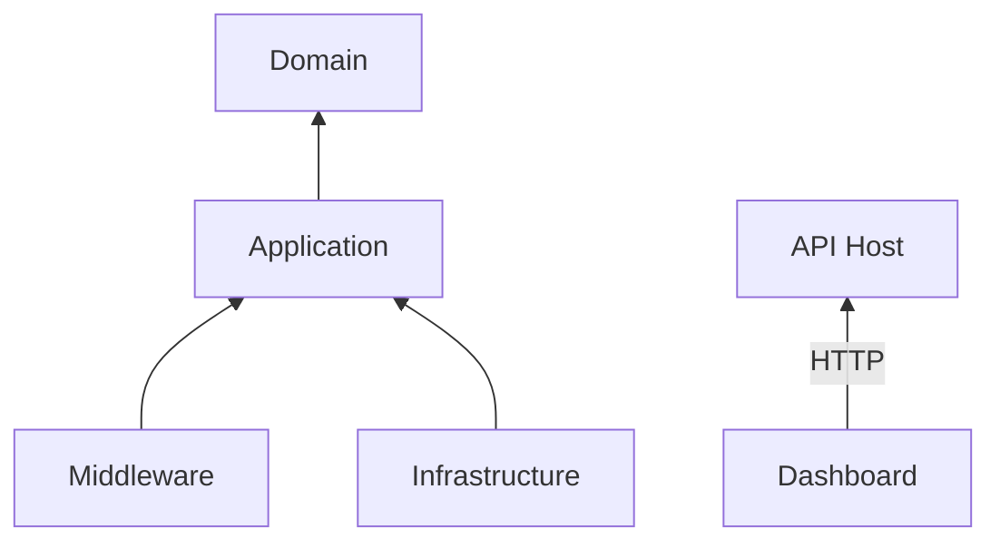
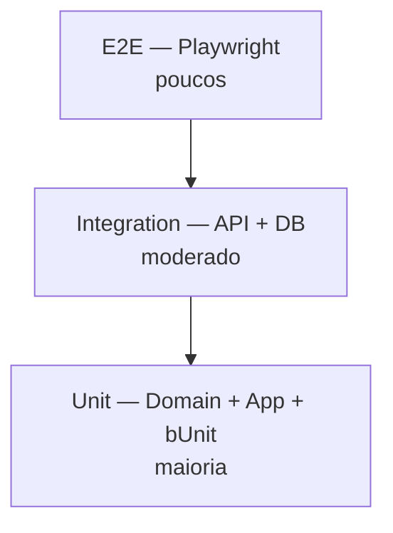
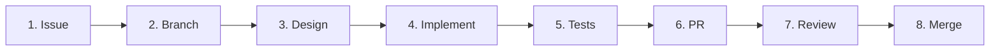

# ThrottleWatch — Development Guide

> **Constituição do projeto.** Este documento define como o ThrottleWatch deve ser desenvolvido, mantido e estendido. Todo contribuidor deve seguir estas regras.
>
> **Fonte de verdade arquitetural:** `ARCHITECTURE.md` prevalece sobre este guia em caso de conflito. **SignalR não faz parte da arquitetura** (ADR-012). Comunicação Dashboard ↔ Api é exclusivamente HTTP/REST.

| | |
|---|---|
| **Público-alvo** | Desenvolvedores e mantenedores |
| **Escopo** | Arquitetura, convenções, fluxo de trabalho e padrões de código |
| **Runtime alvo** | .NET 10 (compatível com .NET 9 quando aplicável) |
| **Última revisão** | 2026 |

---

## Índice

1. [Filosofia do Projeto](#1-filosofia-do-projeto)
2. [Arquitetura Geral](#2-arquitetura-geral)
3. [Estrutura da Solution](#3-estrutura-da-solution)
4. [Organização das Pastas](#4-organização-das-pastas)
5. [Convenções de Código](#5-convenções-de-código)
6. [Clean Architecture](#6-clean-architecture)
7. [Frontend (Dashboard)](#7-frontend-dashboard)
8. [Backend (API e Application)](#8-backend-api-e-application)
9. [Middleware](#9-middleware)
10. [Comunicação Dashboard ↔ Api](#10-comunicação-dashboard--api)
11. [Persistência](#11-persistência)
12. [Background Workers](#12-background-workers)
13. [Logging](#13-logging)
14. [Tratamento de Erros](#14-tratamento-de-erros)
15. [Performance](#15-performance)
16. [Segurança](#16-segurança)
17. [Testes](#17-testes)
18. [Fluxo de Desenvolvimento](#18-fluxo-de-desenvolvimento)
19. [Commits](#19-commits)
20. [Pull Requests](#20-pull-requests)
21. [Roadmap](#21-roadmap)
22. [Regras Absolutas](#22-regras-absolutas)

---

## 1. Filosofia do Projeto

### Por que o ThrottleWatch existe

O ASP.NET Core possui Rate Limiting nativo, mas **não oferece observabilidade**. Requisições bloqueadas desaparecem silenciosamente. Não há visibilidade sobre endpoints, IPs, políticas ou tendências históricas.

O ThrottleWatch preenche essa lacuna como uma **camada de observabilidade** para Rate Limiting — plug-and-play, sem instrumentação manual.

### Problema que resolve

| Problema | Solução ThrottleWatch |
|---|---|
| Bloqueios invisíveis | Métricas e logs de cada requisição bloqueada |
| Sem histórico | Persistência com séries temporais |
| Alertas manuais | Sistema de alertas integrado |
| Políticas mal calibradas | Insights e recomendações |
| Zero dashboard | Blazor Dashboard em tempo real |

### Objetivos

1. **Observabilidade completa** — métricas, histórico, alertas e insights
2. **Zero configuração** — duas linhas no `Program.cs` do consumidor
3. **Performance mínima** — hot path em `O(1)`, sem bloqueio de requests
4. **Open Source de qualidade** — padrão de projetos como ASP.NET Core e EF Core
5. **Extensibilidade** — arquitetura preparada para multi-tenant, OpenTelemetry e plugins

### Princípios que nunca devem ser quebrados

> [!IMPORTANT]
> Estes princípios são inegociáveis em qualquer contribuição.

| Princípio | Descrição |
|---|---|
| **Non-blocking hot path** | Middleware nunca bloqueia a thread de request |
| **Separation of concerns** | UI não acessa banco; Components não chamam HTTP diretamente |
| **Official Microsoft patterns** | Blazor Web App, DI, Options, HttpClientFactory |
| **Testability** | Toda lógica de negócio testável sem infraestrutura |
| **Small PRs** | Uma funcionalidade por PR; ideal ≤ 20 arquivos |
| **No fictitious data in UI** | Componentes exibem estados reais ou Empty/Error states |

---

## 2. Arquitetura Geral

### Visão de alto nível

```mermaid
flowchart TB
    subgraph Client["Cliente HTTP"]
        REQ[Request]
    end

    subgraph API["ASP.NET Core API"]
        MW[ThrottleWatch Middleware]
        RL[Rate Limiting nativo]
    end

    subgraph Async["Processamento assíncrono"]
        Q[In-Memory Queue<br/>System.Threading.Channels]
        BW[Background Worker<br/>IHostedService]
    end

    subgraph Storage["Persistência"]
        PG[(PostgreSQL<br/>EF Core)]
    end

    subgraph RealTime["Tempo real"]
        DASH[Blazor Dashboard]
    end

    REQ --> MW
    MW --> RL
    MW -->|enqueue O(1)| Q
    Q --> BW
    BW -->|batch insert| PG
    BW -->|broadcast| HUB
    HUB --> DASH
    DASH -->|HTTP| API
```

### Pipeline explicado

| Etapa | Responsabilidade | Bloqueia request? |
|---|---|---|
| **Middleware** | Captura metadata (IP, endpoint, policy, status) em `O(1)` | Não |
| **Queue** | Buffer thread-safe via `Channels` | Não |
| **Background Worker** | Drena fila em batches e persiste | Não (thread separada) |
| **Persistência** | EF Core + PostgreSQL para histórico | Não |
| **Dashboard** | Blazor Web App com Interactive Server | N/A |

### Estado atual vs. planejado

| Componente | Status |
|---|---|
| `ThrottleWatch.Dashboard` | ✅ Implementado |
| `ThrottleWatch.Middleware` | 🔲 Planejado |
| `ThrottleWatch.Application` | 🔲 Planejado |
| `ThrottleWatch.Domain` | 🔲 Planejado |
| `ThrottleWatch.Infrastructure` | 🔲 Planejado |

> [!NOTE]
> Contribuições devem respeitar a arquitetura **planejada**, mesmo que o projeto alvo ainda não exista. Não introduza atalhos que contradigam a estrutura definida neste guia.

---

## 3. Estrutura da Solution

### Árvore completa (alvo)

```
ThrottleWatch.sln
│
├── src/
│   ├── ThrottleWatch.Domain/           # Entidades, value objects, domain events
│   ├── ThrottleWatch.Application/      # Use cases, CQRS, interfaces de aplicação
│   ├── ThrottleWatch.Infrastructure/   # EF Core, repositórios, serviços externos
│   ├── ThrottleWatch.Middleware/       # Middleware ASP.NET Core + extensions
│   └── ThrottleWatch.Dashboard/        # Blazor Web App (Interactive Server)
│
├── tests/
│   ├── ThrottleWatch.UnitTests/        # Domain + Application
│   ├── ThrottleWatch.IntegrationTests/ # API + banco
│   ├── ThrottleWatch.Dashboard.Tests/  # bUnit (componentes e serviços UI)
│   └── ThrottleWatch.E2ETests/         # Playwright (futuro)
│
├── samples/
│   ├── BasicApi/
│   └── WebApiWithPolicies/
│
├── docs/
│   └── images/
│
├── DEVELOPMENT_GUIDE.md
├── README.md
└── global.json
```

### Responsabilidade de cada projeto

| Projeto | Pode referenciar | Responsabilidade |
|---|---|---|
| **Domain** | Nada | Regras de negócio puras, entidades, enums, events |
| **Application** | Domain | Commands, Queries, handlers, interfaces de serviço |
| **Infrastructure** | Application, Domain | EF Core, repositórios, implementações concretas |
| **Middleware** | Application | Interceptação de requests, enqueue de métricas |
| **Dashboard** | Nenhum projeto interno* | UI Blazor, HTTP clients |

\* O Dashboard comunica-se com a API via HTTP. Não referencia Domain, Application ou Infrastructure diretamente.

### Quando criar um novo projeto

| Situação | Ação |
|---|---|
| Nova camada de domínio | Adicionar em `Domain` |
| Novo use case | Adicionar em `Application` |
| Nova integração externa | Adicionar em `Infrastructure` |
| Nova UI ou página | Adicionar em `Dashboard` |
| Biblioteca reutilizável independente | Novo projeto em `src/` com aprovação do mantenedor |

> [!WARNING]
> Não crie projetos por conveniência. Prefira estender projetos existentes antes de fragmentar a solution.

---

## 4. Organização das Pastas

### Mapa por camada

#### Domain (`ThrottleWatch.Domain/`)

```
Domain/
├── Entities/
├── ValueObjects/
├── Enums/
├── Events/
└── Exceptions/
```

#### Application (`ThrottleWatch.Application/`)

```
Application/
├── Commands/
├── Queries/
├── Handlers/
├── Interfaces/
├── DTOs/              # DTOs de saída da aplicação (não confundir com DTOs HTTP)
├── Validators/
└── Behaviors/
```

#### Infrastructure (`ThrottleWatch.Infrastructure/`)

```
Infrastructure/
├── Persistence/
│   ├── Configurations/
│   ├── Migrations/
│   └── Repositories/
├── Workers/
└── Extensions/
```

#### Middleware (`ThrottleWatch.Middleware/`)

```
Middleware/
├── ThrottleWatchMiddleware.cs
├── Extensions/
└── Options/
```

#### Dashboard (`ThrottleWatch.Dashboard/`)

```
Dashboard/
├── Components/
│   ├── Layout/        # Sidebar, Topbar, MainLayout
│   ├── Pages/         # Rotas (@page)
│   ├── Shared/        # Badge, Toast, EmptyState, etc.
│   ├── Cards/         # MetricCard, ContentCard
│   ├── Charts/        # ApexCharts wrappers
│   └── Tables/        # Tabelas com ordenação
├── Models/            # Modelos de domínio da UI
├── DTOs/              # Contratos HTTP + ToModel()
├── Extensions/        # ServiceCollectionExtensions
├── Models/            # ThrottleWatchOptions
└── wwwroot/           # CSS, assets estáticos
```

### Onde colocar cada artefato

| Artefato | Localização |
|---|---|
| Razor Component reutilizável | `Components/Shared/` |
| Página com rota | `Components/Pages/` |
| Gráfico | `Components/Charts/` |
| Tabela | `Components/Tables/` |
| Card de métrica | `Components/Cards/` |
| Serviço de UI | `Services/` + interface `I*` |
| Contrato HTTP da API | `DTOs/` |
| Modelo usado na UI | `Models/` |
| Registro DI | `Extensions/ServiceCollectionExtensions.cs` |
| Middleware | `ThrottleWatch.Middleware/` |
| Worker | `Infrastructure/Workers/` |
| Command (CQRS) | `Application/Commands/` |
| Query (CQRS) | `Application/Queries/` |
| Validator | `Application/Validators/` |
| Repository | `Infrastructure/Persistence/Repositories/` |
| EF Configuration | `Infrastructure/Persistence/Configurations/` |
| Migration | `Infrastructure/Persistence/Migrations/` |
| Controller / Minimal API | `Infrastructure/` ou projeto API dedicado |

---

## 5. Convenções de Código

### Namespaces

```csharp
// Padrão: ThrottleWatch.{Projeto}.{Pasta}
namespace ThrottleWatch.Dashboard.Services;
namespace ThrottleWatch.Application.Commands.Metrics;
namespace ThrottleWatch.Domain.Entities;
```

### Classes e tipos

| Tipo | Convenção | Exemplo |
|---|---|---|
| Classe | PascalCase, substantivo | `MetricsService` |
| Interface | `I` + PascalCase | `IMetricsService` |
| Record | PascalCase | `DashboardMetricsDto` |
| Enum | PascalCase singular | `AlertSeverity` |
| DTO | Sufixo `Dto` | `EndpointMetricsDto` |
| Command | Sufixo `Command` | `RecordMetricCommand` |
| Query | Sufixo `Query` | `GetTopEndpointsQuery` |
| Handler | Sufixo `Handler` | `GetTopEndpointsQueryHandler` |
| Validator | Sufixo `Validator` | `RecordMetricCommandValidator` |
| Extension | Sufixo `Extensions` | `ServiceCollectionExtensions` |
| Hub | Sufixo `Hub` | `ThrottleWatchHub` |
| Worker | Sufixo `Worker` | `MetricsPersistenceWorker` |
| Options | Sufixo `Options` | `ThrottleWatchOptions` |

### Campos, propriedades e parâmetros

```csharp
public sealed class MetricsService : IMetricsService
{
    private readonly HttpClient _httpClient;       // campo privado: _camelCase
    private readonly ILogger<MetricsService> _logger;

    public const int DefaultPageSize = 50;         // constante: PascalCase

    public async Task<DashboardMetrics?> GetDashboardMetricsAsync(
        CancellationToken cancellationToken = default)  // parâmetro: camelCase
    {
        // ...
    }
}
```

### Razor Components

| Elemento | Convenção |
|---|---|
| Arquivo | PascalCase: `MetricCard.razor` |
| Parâmetro | PascalCase: `[Parameter] public string Label` |
| Campo privado | `_camelCase` |
| Método handler | PascalCase: `RefreshAsync()` |
| CSS class | BEM com prefixo `--`: `btn--primary`, `card__title` |

### DTOs e mapeamento

```csharp
// DTO recebe dados da API (JSON)
public sealed record DashboardMetricsDto(long TotalRequests, /* ... */)
{
    // Mapeamento explícito para Model da UI
    public DashboardMetrics ToModel() => new()
    {
        TotalRequests = TotalRequests,
        // ...
    };
}
```

> [!NOTE]
> DTOs pertencem à camada que os consome. DTOs HTTP ficam no Dashboard; DTOs de aplicação ficam no Application.

---

## 6. Clean Architecture

### Camadas e dependências



### Regras de dependência

| Camada | Pode depender de | Nunca depende de |
|---|---|---|
| Domain | — | Application, Infrastructure, Dashboard |
| Application | Domain | Infrastructure, Dashboard |
| Infrastructure | Application, Domain | Dashboard |
| Middleware | Application | Infrastructure (preferir interfaces) |
| Dashboard | — (apenas NuGet/packages) | Domain, Application, Infrastructure |

### O que nunca deve acontecer

```csharp
// ❌ PROIBIDO — Component acessando HttpClient diretamente
@inject HttpClient Http
var data = await Http.GetFromJsonAsync<...>("api/metrics");

// ✅ CORRETO — via serviço injetado
@inject IMetricsService MetricsService
var data = await MetricsService.GetDashboardMetricsAsync();
```

```csharp
// ❌ PROIBIDO — UI acessando DbContext
@inject ThrottleWatchDbContext Db

// ✅ CORRETO — via API/Application layer
@inject IMetricsService MetricsService
```

---

## 7. Frontend (Dashboard)

### Stack

| Tecnologia | Uso |
|---|---|
| Blazor Web App | Framework UI |
| Interactive Server | Render mode global via `<Routes @rendermode="InteractiveServer" />` |
| Blazor-ApexCharts | Gráficos |
| HttpClientFactory | Comunicação HTTP tipada |
| Options Pattern | Configuração via `appsettings.json` |
| CSS custom properties | Temas dark/light |

### Estrutura de responsabilidades

| Camada UI | Responsabilidade |
|---|---|
| **Pages** | Orquestração: carrega dados, trata estados, compõe componentes |
| **Layout** | Shell da aplicação (sidebar, topbar, tema) |
| **Shared** | Componentes genéricos reutilizáveis |
| **Cards / Charts / Tables** | Componentes de domínio visual |
| **Services** | Comunicação HTTP, tema, toast |
| **DTOs** | Contrato com API + `ToModel()` |
| **Models** | Objetos usados pelos componentes |

### Quando criar um novo componente

| Critério | Ação |
|---|---|
| Usado em 2+ páginas | Extrair para `Shared/`, `Cards/`, `Charts/` ou `Tables/` |
| Lógica visual isolada (gráfico, tabela) | Componente dedicado |
| Apenas uma página | Manter inline na Page até haver reuso |
| > 150 linhas em um `.razor` | Dividir em subcomponentes |

### Quando reutilizar vs. dividir

```
Shared/     → genérico (Badge, EmptyState, LoadingSpinner)
Cards/      → containers de conteúdo (MetricCard, ContentCard)
Charts/     → wrappers ApexCharts
Tables/     → tabelas com sorting/filtering
Pages/      → composição; sem lógica HTTP direta
```

### Adicionar uma nova página

1. Criar `Components/Pages/{Nome}Page.razor` com `@page "/rota"`
2. Adicionar `<PageTitle>` e header padrão (`page-header`, `page-title`, `page-subtitle`)
3. Injetar serviço (`IMetricsService` ou novo `I*Service`)
4. Implementar estados: loading, error, empty, success
5. Adicionar link no `Sidebar.razor`
6. Adicionar título no `GetPageTitle()` do `MainLayout.razor`
7. Criar testes bUnit se houver lógica relevante

### Adicionar um gráfico

1. Criar `Components/Charts/{Nome}Chart.razor`
2. Receber dados via `[Parameter]`, nunca buscar HTTP internamente
3. Configurar ApexCharts com variáveis CSS do tema (`var(--tw-*)`)
4. Implementar `IsLoading` e EmptyState
5. Referenciar na Page via composição

### Estados obrigatórios em Pages

Toda page que consome dados deve tratar:

| Estado | Componente |
|---|---|
| Carregando | `LoadingSpinner`, `SkeletonCard` ou `IsLoading` nos cards |
| Erro | `<ErrorState OnRetry="..." />` |
| Vazio | `<EmptyState />` |
| Sucesso | Conteúdo normal |

### Atualização de dados no Dashboard

- Pages usam polling HTTP (`PeriodicTimer` + `RefreshIntervalSeconds`)
- Cancelar o polling em `Dispose` / `DisposeAsync`
- Atualizações de UI via `InvokeAsync(StateHasChanged)`

---

## 8. Backend (API e Application)

> Seção define padrões para implementação futura. Siga estes contratos desde o primeiro commit de backend.

### Organização

```
Application/
├── Commands/
│   └── RecordMetric/
│       ├── RecordMetricCommand.cs
│       ├── RecordMetricCommandHandler.cs
│       └── RecordMetricCommandValidator.cs
├── Queries/
│   └── GetTopEndpoints/
│       ├── GetTopEndpointsQuery.cs
│       └── GetTopEndpointsQueryHandler.cs
└── Interfaces/
    └── IMetricsRepository.cs
```

### Endpoints (Minimal API preferido)

```csharp
// Padrão de rota
app.MapGet("/api/throttlewatch/metrics/summary", GetDashboardMetrics)
   .WithName("GetDashboardMetrics")
   .WithTags("Metrics")
   .Produces<DashboardMetricsDto>();
```

| Recurso | Rota base |
|---|---|
| Métricas | `/api/throttlewatch/metrics` |
| Endpoints | `/api/throttlewatch/endpoints` |
| Clientes | `/api/throttlewatch/clients` |
| Políticas | `/api/throttlewatch/policies` |
| Alertas | `/api/throttlewatch/alerts` |
| Insights | `/api/throttlewatch/insights` |
| Health | `/api/throttlewatch/health` |

### Adicionar um endpoint

1. Definir Query/Command no Application
2. Implementar Handler
3. Adicionar Validator (FluentValidation)
4. Expor via Minimal API ou Controller
5. Criar DTO de resposta
6. Adicionar teste de integração
7. Atualizar contrato no Dashboard (`IMetricsService` + DTO)

---

## 9. Middleware

### Responsabilidade

Capturar metadata de cada request **sem bloquear** e enfileirar para processamento assíncrono.

### Template

```csharp
public sealed class ThrottleWatchMiddleware(RequestDelegate next)
{
    public async Task InvokeAsync(HttpContext context, IMetricQueue queue)
    {
        var sw = ValueStopwatch.StartNew();

        await next(context);

        // O(1) — apenas enqueue, nunca await persistência aqui
        queue.TryEnqueue(new MetricEntry(
            Path: context.Request.Path,
            Method: context.Request.Method,
            StatusCode: context.Response.StatusCode,
            DurationMs: sw.GetElapsedTime().TotalMilliseconds,
            ClientIp: context.Connection.RemoteIpAddress?.ToString(),
            Timestamp: DateTimeOffset.UtcNow
        ));
    }
}
```

### Boas práticas

| Regra | Motivo |
|---|---|
| Nunca `await` banco ou HTTP no middleware | Bloqueia hot path |
| Usar `TryEnqueue` (non-blocking) | Evita backpressure na request |
| Capturar dados após `next()` | Status code final disponível |
| Registrar via DI | Testabilidade |

### Registro

```csharp
app.UseRouting();
app.UseRateLimiter();
app.UseThrottleWatch();   // após routing, antes de endpoints
app.MapControllers();
```

---

## 10. Comunicação Dashboard ↔ Api

**SignalR não é utilizado** (ver ADR-012 em `ARCHITECTURE.md`).

- Dashboard consome apenas endpoints HTTP/REST da Api
- Atualizações da UI usam **polling HTTP** (`RefreshIntervalSeconds` em `ThrottleWatchOptions`)
- Não criar Hubs, `HubConnection`, nem pacote `Microsoft.AspNetCore.SignalR.Client`

---

## 11. Persistência

### Stack

- **EF Core** com PostgreSQL
- **Code First** com Fluent API Configurations
- **Migrations** versionadas no repositório

### DbContext

```csharp
public sealed class ThrottleWatchDbContext(DbContextOptions<ThrottleWatchDbContext> options)
    : DbContext(options)
{
    public DbSet<MetricEntry> Metrics => Set<MetricEntry>();

    protected override void OnModelCreating(ModelBuilder modelBuilder)
    {
        modelBuilder.ApplyConfigurationsFromAssembly(typeof(ThrottleWatchDbContext).Assembly);
    }
}
```

### Configurations

```csharp
// Infrastructure/Persistence/Configurations/MetricEntryConfiguration.cs
public sealed class MetricEntryConfiguration : IEntityTypeConfiguration<MetricEntry>
{
    public void Configure(EntityTypeBuilder<MetricEntry> builder)
    {
        builder.ToTable("metrics");
        builder.HasKey(m => m.Id);
        builder.HasIndex(m => m.Timestamp);
        builder.HasIndex(m => new { m.Path, m.Timestamp });
    }
}
```

### Migrations

```bash
# Criar migration
dotnet ef migrations add AddMetricsTable \
  --project src/ThrottleWatch.Infrastructure \
  --startup-project src/ThrottleWatch.Api

# Aplicar
dotnet ef database update \
  --project src/ThrottleWatch.Infrastructure \
  --startup-project src/ThrottleWatch.Api
```

### Regras

| Regra | Detalhe |
|---|---|
| Índices em colunas de filtro temporal | `Timestamp`, `Path`, `ClientIp` |
| Nunca query na UI | Sempre via Application/Repository |
| Batch inserts no Worker | `AddRangeAsync` + `SaveChangesAsync` |
| Retention configurável | `Storage:RetentionDays` no Options |

---

## 12. Background Workers

### Responsabilidade

Drenar a fila in-memory e persistir em batches. Sem notificação SignalR.

### Template

```csharp
public sealed class MetricsPersistenceWorker(
    IMetricQueue queue,
    IServiceScopeFactory scopeFactory,
    IHubContext<ThrottleWatchHub> hub,
    IOptions<ThrottleWatchOptions> options,
    ILogger<MetricsPersistenceWorker> logger) : BackgroundService
{
    protected override async Task ExecuteAsync(CancellationToken stoppingToken)
    {
        while (!stoppingToken.IsCancellationRequested)
        {
            var batch = queue.DequeueBatch(options.Value.BatchSize);

            if (batch.Count == 0)
            {
                await Task.Delay(options.Value.PollIntervalMs, stoppingToken);
                continue;
            }

            await using var scope = scopeFactory.CreateAsyncScope();
            var repository = scope.ServiceProvider.GetRequiredService<IMetricsRepository>();

            await repository.AddRangeAsync(batch, stoppingToken);
            await hub.Clients.All.SendAsync("MetricsUpdated", /* ... */, stoppingToken);
        }
    }
}
```

### Regras

| Regra | Motivo |
|---|---|
| Usar `IServiceScopeFactory` | DbContext scoped por batch |
| Batch configurável | Performance vs. latência |
| Tratar exceções por batch | Um batch falho não derruba o worker |
| Log estruturado | Observabilidade do próprio ThrottleWatch |

---

## 13. Logging

### Stack

Serilog (ou `ILogger<T>` nativo) com logs estruturados.

### O que registrar

| Evento | Nível |
|---|---|
| Request bloqueada pelo rate limiter | Information |
| Batch persistido | Debug |
| Falha de persistência | Error |
| Startup / shutdown | Information |
| Configuração inválida | Critical |

### O que NÃO registrar

| Dado | Motivo |
|---|---|
| Corpo completo de requests | Privacidade / volume |
| Tokens / API Keys | Segurança |
| IPs em produção (sem opt-in) | LGPD/GDPR |
| Stack traces em respostas HTTP | Segurança |

### Padrão

```csharp
_logger.LogInformation(
    "Metric batch persisted. Count={Count}, DurationMs={DurationMs}",
    batch.Count,
    sw.ElapsedMilliseconds);
```

---

## 14. Tratamento de Erros

### Princípio

**Nunca** propagar exceções não tratadas para o usuário. **Nunca** engolir exceções silenciosamente.

### Dashboard (UI)

```csharp
try
{
    _metrics = await MetricsService.GetDashboardMetricsAsync(_cts.Token);
}
catch (OperationCanceledException) { /* cancelamento esperado */ }
catch
{
    _hasError = true;
}
finally
{
    _isLoading = false;
    StateHasChanged();
}
```

### API

```csharp
// Problem Details (RFC 7807)
app.UseExceptionHandler();
app.UseStatusCodePages();
```

### Result Pattern (Application layer)

```csharp
public sealed record Result<T>
{
    public T? Value { get; init; }
    public string? Error { get; init; }
    public bool IsSuccess => Error is null;

    public static Result<T> Success(T value) => new() { Value = value };
    public static Result<T> Failure(string error) => new() { Error = error };
}
```

Use Result Pattern em handlers quando falhas são **esperadas** (ex.: policy não encontrada). Use exceções para condições **extraordinárias** (ex.: banco indisponível).

---

## 15. Performance

### Regras do hot path

| Regra | Detalhe |
|---|---|
| Middleware em `O(1)` | Apenas enqueue |
| Sem alocações desnecessárias | `ValueStopwatch`, `TryEnqueue` |
| Sem `async` desnecessário no middleware | `Task` completado síncrono quando possível |
| Batch no Worker | Configurável (default: 100-500 items) |

### Frontend

| Técnica | Quando usar |
|---|---|
| `@rendermode` no `<Routes />` | Interactive Server global (padrão atual) |
| `Virtualize` | Listas com > 50 items |
| Skeleton / loading states | Toda operação async |
| Lazy loading de charts | Pages com múltiplos gráficos |

### Caching

| Camada | Estratégia |
|---|---|
| API | `IMemoryCache` para queries frequentes (top endpoints) |
| Dashboard | Sem cache local — polling HTTP mantém dados frescos |
| Worker | Sem cache — write-through para PostgreSQL |

---

## 16. Segurança

### Autenticação

| Mecanismo | Uso |
|---|---|
| JWT Bearer | APIs protegidas |
| API Keys | Integração machine-to-machine |
| ASP.NET Core Identity | Dashboard com login (opcional) |

### Proteção do Dashboard

```json
{
  "ThrottleWatch": {
    "Dashboard": {
      "RequireAuthentication": true,
      "AuthorizationPolicy": "AdminOnly"
    }
  }
}
```

### Validação de entrada

- FluentValidation em todo Command
- Nunca confiar em input do cliente
- Sanitizar strings exibidas na UI (`@alert.Message` vem da API, não do usuário)

### Regras

| Regra | Detalhe |
|---|---|
| Secrets em User Secrets / env vars | Nunca no repositório |
| HTTPS obrigatório em produção | `UseHsts()` |
| CORS configurado explicitamente | Não usar `AllowAnyOrigin` em produção |
| Rate limit no próprio dashboard | Proteção contra abuse |

---

## 17. Testes

### Pirâmide



### Tipos e ferramentas

| Tipo | Projeto | Ferramenta | O que testar |
|---|---|---|---|
| Unit (Domain/App) | `ThrottleWatch.UnitTests` | xUnit | Handlers, validators, domain logic |
| Unit (UI) | `ThrottleWatch.Dashboard.Tests` | xUnit + bUnit | Components, services, DTO mapping |
| Integration | `ThrottleWatch.IntegrationTests` | xUnit + WebApplicationFactory | Endpoints, DB |
| E2E | `ThrottleWatch.E2ETests` | Playwright | Fluxos completos (futuro) |

### Quando criar testes

| Situação | Teste obrigatório? |
|---|---|
| Novo componente Shared | ✅ bUnit |
| Novo serviço com lógica | ✅ Unit |
| Novo handler CQRS | ✅ Unit |
| Novo endpoint API | ✅ Integration |
| Page apenas composição visual | Opcional |
| DTO com `ToModel()` | ✅ Mapping test |

### Padrão bUnit

```csharp
[Fact]
public void MetricCard_RendersLabel()
{
    using var ctx = new Bunit.TestContext();
    var cut = ctx.RenderComponent<MetricCard>(p => p
        .Add(x => x.Label, "Total")
        .Add(x => x.Value, "1.2K"));

    cut.Markup.Should().Contain("Total");
    cut.Markup.Should().Contain("1.2K");
}
```

### Cobertura esperada

| Camada | Meta |
|---|---|
| Domain + Application | ≥ 80% |
| Dashboard Services | ≥ 70% |
| Components | Componentes Shared e Cards |
| Integration | Todos os endpoints |

---

## 18. Fluxo de Desenvolvimento

### Passo a passo para nova funcionalidade



| Passo | Ação | Detalhe |
|---|---|---|
| **1** | Criar Issue | Descrever problema, escopo e critérios de aceite |
| **2** | Criar Branch | `feat/`, `fix/`, `docs/`, `refactor/` + descrição curta |
| **3** | Design | Se envolver arquitetura, discutir na Issue antes de codar |
| **4** | Models/DTOs | Contratos de dados primeiro |
| **5** | Services/Handlers | Lógica de negócio |
| **6** | UI/API | Componentes ou endpoints |
| **7** | Testes | Unit + integration conforme seção 17 |
| **8** | PR | Checklist da seção 20 |

### Exemplo: adicionar métrica "Top Policies"

```
1. Issue: "Add Top Policies widget to Overview"
2. Branch: feat/top-policies-widget
3. DTO:  PolicyMetricsDto + ToModel()
4. API:   GET /api/throttlewatch/policies/top
5. Service: IMetricsService.GetTopPoliciesAsync()
6. UI:    TopPoliciesBarChart.razor + Overview.razor
7. Test:  DtoMappingTests + bUnit chart component
8. PR:    ~8-12 arquivos
```

---

## 19. Commits

### Conventional Commits

```
<tipo>(<escopo>): <descrição curta>

[corpo opcional]
```

### Tipos

| Tipo | Uso |
|---|---|
| `feat` | Nova funcionalidade |
| `fix` | Correção de bug |
| `docs` | Documentação |
| `refactor` | Refatoração sem mudança de comportamento |
| `test` | Testes |
| `chore` | Build, CI, deps |
| `perf` | Performance |

### Exemplos

```
feat(dashboard): add Top Policies chart to Overview
fix(signalr): handle reconnection after server restart
docs: add DEVELOPMENT_GUIDE.md
test(dashboard): add bUnit tests for Badge component
refactor(middleware): extract metric capture to dedicated service
chore(deps): bump Blazor-ApexCharts to 6.2.0
```

### Regras

- **Uma linha** na maioria dos commits
- **Imperativo** em inglês: "add", "fix", "remove"
- **Escopo** = projeto ou área: `dashboard`, `middleware`, `api`
- Não commitar WIP no main

---

## 20. Pull Requests

### Tamanho

| Classificação | Arquivos | Recomendação |
|---|---|---|
| Ideal | ≤ 20 | Merge rápido |
| Aceitável | 21–40 | Justificar na descrição |
| Grande demais | > 40 | Dividir em PRs menores |

> [!WARNING]
> PRs com 70+ arquivos dificultam review e aumentam risco de regressão. Evitar.

### Template

```markdown
## Summary
- Brief description of what changed and why

## Test plan
- [ ] Unit tests pass
- [ ] Manual testing done
- [ ] No new warnings
```

### Checklist antes de abrir PR

- [ ] Código compila sem erros
- [ ] Testes passam (`dotnet test`)
- [ ] Sem warnings novos
- [ ] Sem código morto ou comentado
- [ ] Sem `TODO` ou `FIXME` sem Issue
- [ ] Sem dados fictícios em componentes
- [ ] Sem secrets ou connection strings
- [ ] PR focado em **um objetivo**
- [ ] Commit messages seguem Conventional Commits
- [ ] Documentação atualizada (se aplicável)

---

## 21. Roadmap

### Como adicionar funcionalidades

1. **Propor via Issue** com contexto, escopo e critérios de aceite
2. **Validar com mantenedor** antes de implementações grandes
3. **Implementar incrementalmente** — PRs pequenos e frequentes
4. **Documentar** mudanças relevantes neste guia ou no README

### Priorização

| Prioridade | Critério |
|---|---|
| P0 | Bug crítico, security, data loss |
| P1 | Feature core (middleware, persistência, API) |
| P2 | Dashboard enhancements |
| P3 | Nice-to-have (themes, export, plugins) |

### Evitar crescimento descontrolado

| Regra | Motivo |
|---|---|
| Toda feature começa com Issue | Rastreabilidade |
| Não mergear sem review | Qualidade |
| Deprecar antes de remover | Compatibilidade |
| Versionamento semântico | NuGet consumers |
| Feature flags para experimental | Isolamento de risco |

### Versões planejadas

| Versão | Foco |
|---|---|
| v1.0 | Middleware + Dashboard + PostgreSQL |
| v1.1 | Alertas (Webhook, Slack, Discord, Email) |
| v1.2 | Insights e recomendações |
| v1.3 | Multi-tenant |
| v1.4 | OpenTelemetry export |

---

## 22. Regras Absolutas

> [!CAUTION]
> Violações destas regras resultam em rejeição do PR.

| # | Regra |
|---|---|
| 1 | **Nunca** duplicar código — extrair para Shared/Services/Extensions |
| 2 | **Nunca** quebrar Clean Architecture — respeitar dependências entre camadas |
| 3 | **Nunca** acessar banco diretamente da UI |
| 4 | **Nunca** chamar HTTP/API diretamente de Components — usar Services |
| 5 | **Sempre** usar Dependency Injection |
| 6 | **Sempre** criar testes para lógica de negócio e componentes Shared |
| 7 | **Sempre** seguir SOLID |
| 8 | **Sempre** tratar estados loading/error/empty na UI |
| 9 | **Sempre** manter compatibilidade .NET 9 / .NET 10 |
| 10 | **Sempre** seguir documentação oficial Microsoft para Blazor, EF Core |
| 11 | **Sempre** usar Options Pattern para configuração |
| 12 | **Sempre** usar HttpClientFactory para HTTP clients |
| 13 | **Nunca** bloquear requests no Middleware |
| 14 | **Nunca** commitar secrets, `.env`, connection strings |
| 15 | **Nunca** mergear PRs grandes sem justificativa |
| 16 | **Nunca** usar APIs obsoletas do .NET |
| 17 | **Sempre** usar `CancellationToken` em métodos async |
| 18 | **Sempre** implementar `IDisposable`/`IAsyncDisposable` quando assinar eventos |
| 19 | **Nunca** colocar lógica de negócio em Razor Components |
| 20 | **Sempre** manter este guia atualizado quando padrões mudarem |

---

## Referências

| Recurso | Link |
|---|---|
| Blazor Web App | https://learn.microsoft.com/aspnet/core/blazor |
| EF Core | https://learn.microsoft.com/ef/core |
| HttpClientFactory | https://learn.microsoft.com/dotnet/architecture/microservices/implement-resilient-applications/use-httpclientfactory-to-implement-resilient-http-requests |
| Options Pattern | https://learn.microsoft.com/aspnet/core/fundamentals/configuration/options |
| Conventional Commits | https://www.conventionalcommits.org |
| bUnit | https://bunit.dev |

---

<p align="center">
  <strong>ThrottleWatch Development Guide</strong><br/>
  Mantido pelos contribuidores do projeto.<br/>
  Dúvidas? Abra uma <a href="https://github.com/VitorM34/ThrottleWatch/issues">Issue</a>.
</p>
