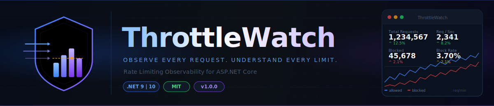
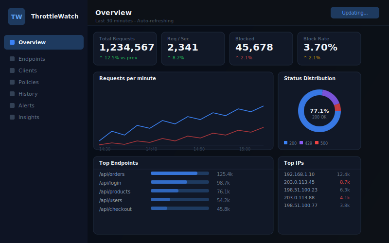
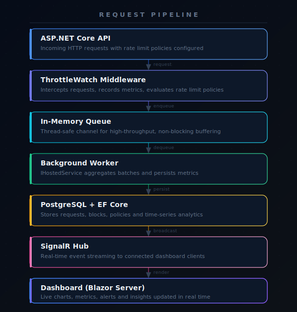
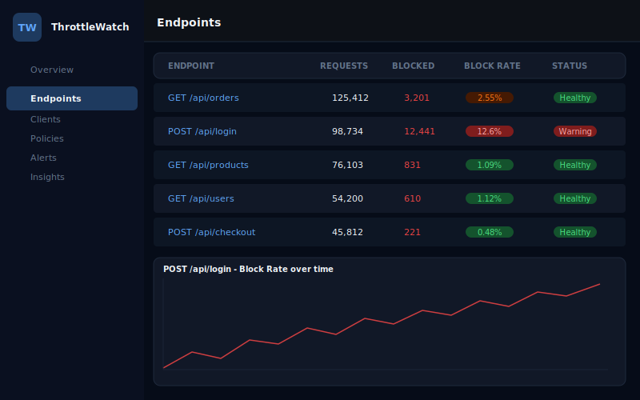
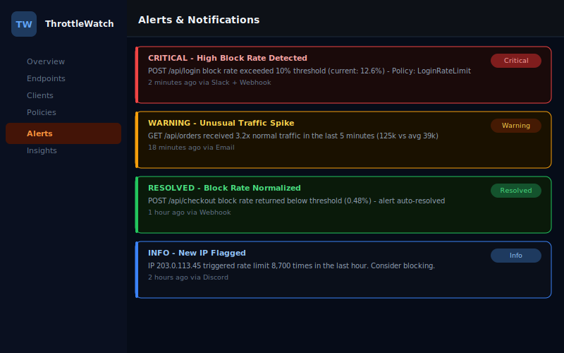
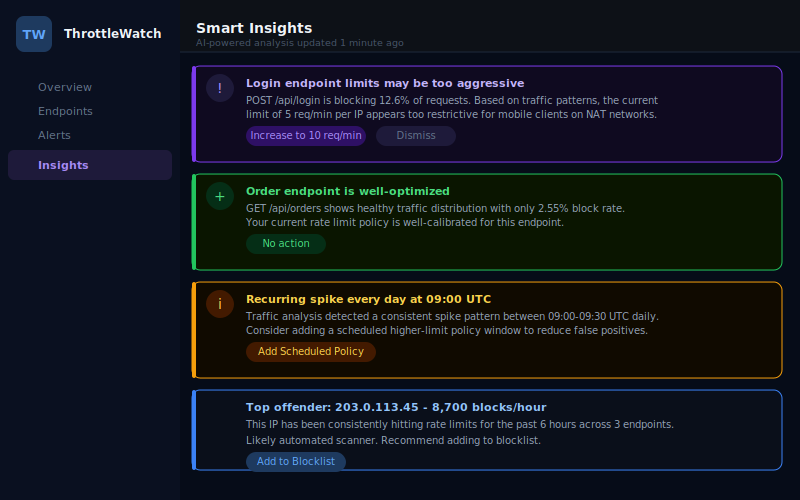

<p align="center">
  
</p>

<p align="center">
  
  
  
  
  
  
  <a href="https://github.com/VitorM34/ThrottleWatch/stargazers">
    
  </a>
  <a href="https://github.com/VitorM34/ThrottleWatch/issues">
    
  </a>
</p>

---

<table>
<tr>
<td width="57%" valign="top">

## 🎯 About the Project

**ThrottleWatch** is a complete observability solution for ASP.NET Core Rate Limiting.

It complements the native Rate Limiting framework by bringing real-time visibility, interactive dashboards, historical analytics, intelligent alerts, and actionable insights — helping you **understand**, **protect**, and **optimize** your APIs.

Zero manual instrumentation. Zero boilerplate. Just plug in and observe.

<br/>

## ⚡ Key Features

<table>
<tr>
  <td>✅ Zero-configuration setup</td>
  <td>✅ Webhook, Slack, Discord &amp; Email alerts</td>
</tr>
<tr>
  <td>✅ Real-time dashboard</td>
  <td>✅ Intelligent insights &amp; recommendations</td>
</tr>
<tr>
  <td>✅ Native ASP.NET Core integration</td>
  <td>✅ Persistence with EF Core + PostgreSQL</td>
</tr>
<tr>
  <td>✅ Live metrics via SignalR</td>
  <td>✅ Multi-tenant support (v1.3)</td>
</tr>
<tr>
  <td>✅ Top IPs, API Keys &amp; Endpoints</td>
  <td>✅ OpenTelemetry export (v1.4)</td>
</tr>
<tr>
  <td>✅ Full historical analytics</td>
  <td>✅ Unit &amp; Integration test coverage</td>
</tr>
</table>

<br/>

## 📦 Installation

```bash
dotnet add package ThrottleWatch
```

<br/>

## 🚀 Quick Start

Add two lines to your `Program.cs`:

```csharp
builder.Services.AddThrottleWatch(builder.Configuration);

app.UseThrottleWatch();
```

That's it. ThrottleWatch will automatically start monitoring every request. Visit `/throttlewatch` to open the dashboard.

</td>
<td width="43%" align="center" valign="top">

<br/><br/>



<br/><br/>

> 📸 *Real-time rate limiting dashboard with live metrics, blocked requests, top endpoints and intelligent alerts.*

<br/>



</td>
</tr>
</table>

---

## 🧠 Why ThrottleWatch?

ASP.NET Core has a great built-in Rate Limiting middleware — but it gives you **zero visibility** into what's happening. You can't see which endpoints are being throttled, which IPs are getting blocked, how your policies are performing, or whether your limits are correctly tuned.

**ThrottleWatch fills that gap.**

| Without ThrottleWatch | With ThrottleWatch |
|---|---|
| 🔴 Requests blocked silently | ✅ Every block logged and visualized |
| 🔴 No idea which IPs are hitting limits | ✅ Real-time top offenders table |
| 🔴 No historical data | ✅ Full time-series analytics |
| 🔴 Alerts require custom code | ✅ Built-in Webhook / Slack / Discord / Email |
| 🔴 Policy tuning is guesswork | ✅ Intelligent recommendations |
| 🔴 Zero observability | ✅ Complete observability layer |

---

## 📸 Screenshots

<table>
<tr>
  <td align="center" width="50%">
    <strong>Dashboard — Overview</strong><br/><br/>
    
  </td>
  <td align="center" width="50%">
    <strong>Endpoints Analytics</strong><br/><br/>
    
  </td>
</tr>
<tr>
  <td align="center" width="50%">
    <strong>Alerts &amp; Notifications</strong><br/><br/>
    
  </td>
  <td align="center" width="50%">
    <strong>Intelligent Insights</strong><br/><br/>
    
  </td>
</tr>
</table>

<p align="center">
  <br/>
  <em>Real-time dashboard — metrics, blocked requests, top endpoints and intelligent alerts</em>
</p>

---

## ⚙️ Configuration

Full configuration via `appsettings.json`:

```json
{
  "ThrottleWatch": {
    "Dashboard": {
      "Route": "/throttlewatch",
      "RequireAuthentication": false
    },
    "Storage": {
      "ConnectionString": "Host=localhost;Database=throttlewatch;Username=postgres;Password=secret",
      "RetentionDays": 30
    },
    "Alerts": {
      "Enabled": true,
      "Channels": {
        "Webhook": { "Url": "https://your-webhook.url" },
        "Slack":   { "WebhookUrl": "https://hooks.slack.com/..." },
        "Discord": { "WebhookUrl": "https://discord.com/api/webhooks/..." },
        "Email":   { "SmtpHost": "smtp.example.com", "To": "ops@example.com" }
      },
      "Rules": [
        {
          "Name": "High Block Rate",
          "Condition": "BlockRate > 10",
          "Cooldown": "00:05:00"
        }
      ]
    },
    "Insights": {
      "Enabled": true,
      "AnalysisInterval": "00:01:00"
    }
  }
}
```

<details>
<summary><strong>🔧 Advanced Registration Options</strong></summary>

```csharp
builder.Services.AddThrottleWatch(options =>
{
    options.Dashboard.Route = "/throttlewatch";
    options.Dashboard.RequireAuthentication = true;
    options.Dashboard.AuthorizationPolicy = "AdminOnly";

    options.Storage.UsePostgres(connectionString);
    options.Storage.RetentionDays = 30;

    options.Alerts.AddWebhook("https://...");
    options.Alerts.AddSlack("https://hooks.slack.com/...");
    options.Alerts.AddEmail(smtp => {
        smtp.Host = "smtp.gmail.com";
        smtp.Port = 587;
        smtp.To.Add("ops@yourcompany.com");
    });

    options.Insights.Enable();
});
```

</details>

---

## 🏗 Architecture

<p align="center">
  
</p>

The pipeline is designed for **minimal overhead** on the hot path:

1. **Middleware** intercepts every request and captures metadata in-process — synchronously and in `O(1)`
2. **In-Memory Queue** (`System.Threading.Channels`) decouples capture from persistence with no blocking
3. **Background Worker** (`IHostedService`) drains the queue in configurable batches and commits to storage
4. **SignalR Hub** broadcasts real-time diffs to all connected dashboard clients
5. **Blazor Dashboard** renders live charts, tables, and insights with automatic updates

---

## 📁 Solution Structure

```
ThrottleWatch.sln
│
├── src/
│   ├── ThrottleWatch.Domain/          # Entities, value objects, domain events
│   ├── ThrottleWatch.Application/     # Use cases, CQRS handlers, interfaces
│   ├── ThrottleWatch.Infrastructure/  # EF Core, repositories, external services
│   ├── ThrottleWatch.Middleware/      # ASP.NET Core middleware + extensions
│   ├── ThrottleWatch.SignalR/         # Real-time hub and contracts
│   └── ThrottleWatch.Dashboard/       # Blazor Server dashboard application
│
├── tests/
│   ├── ThrottleWatch.UnitTests/       # Domain and application unit tests
│   ├── ThrottleWatch.IntegrationTests/# API + database integration tests
│   └── ThrottleWatch.E2ETests/        # Playwright end-to-end tests
│
├── samples/
│   ├── BasicApi/                      # Minimal API example
│   └── WebApiWithPolicies/            # Full configuration example
│
└── docs/
    └── images/                        # Logos, banners, screenshots
```

---

## 🗺 Roadmap

| Version | Status | Features |
|---------|--------|----------|
| **v1.0** | ✅ Released | Dashboard, real-time metrics, historical analytics |
| **v1.1** | ✅ Released | Alerts (Webhook, Slack, Discord, Email) |
| **v1.2** | 🔄 In progress | Smart Insights &amp; AI-powered recommendations |
| **v1.3** | 📋 Planned | Multi-Tenant support |
| **v1.4** | 📋 Planned | Prometheus &amp; Grafana exporters |
| **v2.0** | 🔮 Future | OpenTelemetry native integration |

---

## 🤝 Contributing

Contributions are welcome and greatly appreciated!

1. **Fork** the repository
2. **Create** a feature branch: `git checkout -b feat/amazing-feature`
3. **Commit** your changes: `git commit -m 'feat: add amazing feature'`
4. **Push** to the branch: `git push origin feat/amazing-feature`
5. **Open** a Pull Request

Please read [CONTRIBUTING.md](CONTRIBUTING.md) for contribution guidelines, code of conduct, and PR requirements.

---

## 🧪 Development & Testing

**Prerequisites:** .NET 9 SDK, Docker (for PostgreSQL)

```bash
# Clone the repository
git clone https://github.com/VitorM34/ThrottleWatch.git
cd ThrottleWatch

# Start infrastructure (PostgreSQL)
docker compose up -d

# Restore dependencies
dotnet restore

# Run all tests
dotnet test

# Run the sample application
dotnet run --project samples/WebApiWithPolicies

# Open the dashboard
open http://localhost:5000/throttlewatch
```

---

<table>
<tr>
<td width="33%" valign="top">

### 📚 Documentation

Access the full documentation at:

**[throttlewatch.dev/docs](https://throttlewatch.dev/docs)**

- [Getting Started](https://throttlewatch.dev/docs/getting-started)
- [Configuration Reference](https://throttlewatch.dev/docs/configuration)
- [Dashboard Guide](https://throttlewatch.dev/docs/dashboard)
- [Alerts Setup](https://throttlewatch.dev/docs/alerts)
- [API Reference](https://throttlewatch.dev/docs/api)

</td>
<td width="33%" valign="top">

### 👥 Community

⭐ If this project helps you, please **star** the repo!

- [GitHub Discussions](https://github.com/VitorM34/ThrottleWatch/discussions)
- [Report an Issue](https://github.com/VitorM34/ThrottleWatch/issues/new)
- [Request a Feature](https://github.com/VitorM34/ThrottleWatch/issues/new?template=feature_request.md)
- Contributions are welcome!

</td>
<td width="33%" valign="top">

### 🗺 Roadmap

- ✅ **v1.0** — Dashboard & Metrics
- ✅ **v1.1** — Alerts & Notifications
- 🔄 **v1.2** — Smart Insights
- 📋 **v1.3** — Multi-Tenant
- 📋 **v1.4** — Prometheus / Grafana
- 🔮 **v2.0** — OpenTelemetry

[View full roadmap →](https://github.com/VitorM34/ThrottleWatch/projects)

</td>
</tr>
</table>

---

<p align="center">
  <a href="https://github.com/VitorM34/ThrottleWatch">
    
  </a>
  &nbsp;&nbsp;
  <a href="https://github.com/VitorM34/ThrottleWatch/issues">
    
  </a>
  &nbsp;&nbsp;
  <a href="https://github.com/VitorM34/ThrottleWatch/discussions">
    
  </a>
</p>

<p align="center">
  <sub>Licensed under the <a href="LICENSE">MIT License</a> · Built with ❤️ for the .NET community</sub>
</p>
