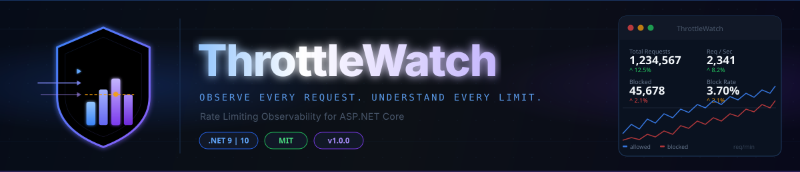

<p align="center">
  
</p>

<p align="center">
  
  
  
  
  <a href="https://github.com/VitorM34/ThrottleWatch/stargazers">
    
  </a>
</p>

---

## About

**ThrottleWatch** adds observability to ASP.NET Core Rate Limiting.

Your app keeps using the built-in rate limiter. The **Client SDK** captures request metrics (including 429s) and ships them to **ThrottleWatch.Api**. Metrics land in **PostgreSQL**. The **Blazor Dashboard** reads them over **REST** (HTTP polling — SignalR was cancelled; see ADR-012).

```
Your ASP.NET Core API  ──(ThrottleWatch Client)──►  ThrottleWatch.Api  ──►  PostgreSQL
                                                          ▲
ThrottleWatch.Dashboard  ──(REST + API key)───────────────┘
```

---

## What works today

| Feature | Status |
|---|---|
| Client SDK NuGet (`ThrottleWatch`) — middleware + batch sender | ✅ |
| Ingest + query API (`/api/metrics`, alerts, insights) | ✅ |
| Shared API key auth (`X-ThrottleWatch-Key`) | ✅ |
| Blazor Dashboard (Overview, endpoints, clients, policies, history, alerts, insights) | ✅ |
| Alerts: Webhook, Slack, Discord, Email | ✅ |
| Insights analyzers | ✅ |
| Serilog + OpenTelemetry hooks on the API | ✅ |
| Docker Compose local stack + sample traffic | ✅ |
| Embedded dashboard inside the consumer app (`/throttlewatch`) | ✅ `UseThrottleWatchDashboard()` (Dashboard RCL, not the Client NuGet) |
| SignalR live push to the Dashboard | ❌ cancelled (REST polling) |
| Multi-tenant | ❌ planned |
| Configurable retention / history rollups | ✅ `Storage:RetentionDays` + minute/hour rollups |

---

## Quick start (golden path)

**Goal:** Dashboard showing real metrics in a few minutes.

**Prerequisites:** .NET 10 SDK, Docker.

```bash
git clone https://github.com/VitorM34/ThrottleWatch.git
cd ThrottleWatch
cp .env.example .env   # optional overrides

make demo
open http://localhost:5100
```

`make demo` starts Postgres + Api + Dashboard + [`samples/WebApiWithPolicies`](samples/WebApiWithPolicies) (Compose profile `demo`), waits for health, then runs a load script against the sample.

| Service | URL |
|---|---|
| Dashboard | http://localhost:5100 |
| API | http://localhost:5080 (`/health` is public) |
| Sample | http://localhost:5299 |
| PostgreSQL | localhost:5432 |

Default shared key (dev): `dev-throttlewatch-key` via `THROTTLEWATCH_API_KEY` in `.env.example`.

After changing app code, rebuild images once:

```bash
make demo-rebuild
```

Stack without sample traffic:

```bash
make up && make health
```

---

## Instrument your API (Client SDK)

Package id: **`ThrottleWatch`** (assembly `ThrottleWatch.Client`).

```bash
dotnet add package ThrottleWatch
```

Local pack (before nuget.org publish):

```bash
make pack-client
dotnet add package ThrottleWatch --source ./artifacts/nuget --version 1.0.0
```

`Program.cs`:

```csharp
using ThrottleWatch.Client.Configuration;

builder.Services.AddThrottleWatch(builder.Configuration);

var app = builder.Build();
app.UseThrottleWatch();
// Keep your own UseRateLimiter() / policies as usual.
```

`appsettings.json` (Client options — this is what `AddThrottleWatch` binds):

```json
{
  "ThrottleWatch": {
    "ApiBaseUrl": "http://localhost:5080",
    "ApiKey": "dev-throttlewatch-key",
    "CaptureOnlyBlocked": false,
    "CaptureClientIp": true,
    "ApiKeyHeaderName": "X-Api-Key",
    "PolicyNameHeaderName": "X-RateLimit-Policy",
    "BatchSize": 50,
    "FlushIntervalMilliseconds": 1000,
    "BufferCapacity": 10000
  }
}
```

| Option | Meaning |
|---|---|
| `ApiBaseUrl` | Base URL of **ThrottleWatch.Api** |
| `ApiKey` | Shared secret sent as **`X-ThrottleWatch-Key`** (API auth) |
| `ApiKeyHeaderName` | Header read from **inbound** traffic to tag metrics (identity), not API auth |
| `PolicyNameHeaderName` | Header used to record the rate-limit policy name on metrics |

Golden-path sample (rate limits + Client already wired): [`samples/WebApiWithPolicies`](samples/WebApiWithPolicies/README.md).

### Embed the Dashboard in your API (`/throttlewatch`)

The Client NuGet does **not** include the UI (ADR-010). Reference `ThrottleWatch.Dashboard` (RCL) and follow the [Blazor RCL](https://learn.microsoft.com/aspnet/core/blazor/components/class-libraries) + [app base path](https://learn.microsoft.com/aspnet/core/blazor/host-and-deploy/app-base-path) host pattern:

```csharp
using ThrottleWatch.Client.Configuration;
using ThrottleWatch.Dashboard.Extensions;

builder.Services.AddThrottleWatch(builder.Configuration);
builder.Services.AddThrottleWatchDashboard(builder.Configuration);

var app = builder.Build();
app.UseThrottleWatch();
app.UseThrottleWatchDashboard(); // default: /throttlewatch
```

`GET /health` on your API stays yours. Dashboard health is `GET /throttlewatch/health`. Standalone Compose Dashboard remains at http://localhost:5100 (root).

---

## Security

| Piece | Behavior |
|---|---|
| Header | `X-ThrottleWatch-Key` (override name via `ThrottleWatch:Security:HeaderName` on the API) |
| Env (Compose) | `THROTTLEWATCH_API_KEY` → Api, Dashboard, and sample Client |
| API config | `ThrottleWatch:Security:ApiKey` |
| Public | `GET /health` (no key) |
| Protected | `/api/*` (metrics, alerts, insights, …) |
| Dashboard | No login UI; it calls the API with the configured key |

**Production:** set a strong `THROTTLEWATCH_API_KEY` / `ThrottleWatch:Security:ApiKey`. Empty key is only allowed in Development (auth disabled with a warning).

---

## Production checklist

- [ ] Strong shared API key (not `dev-throttlewatch-key`)
- [ ] Postgres connection string and backups
- [ ] Compose or equivalent for Api + Dashboard (+ your apps with the Client)
- [ ] Alert channels configured on the **API** (`ThrottleWatch:Alerts` — Webhook / Slack / Discord / Email)
- [ ] Set `ThrottleWatch:Storage:RetentionDays` (default 30) and know History uses minute rollups for ≤6h windows and hourly rollups for longer ranges
- [ ] TLS and network isolation for Api + Postgres in real deploys

---

## Architecture (runtime)

1. **Client middleware** records metrics on the hot path into an in-memory channel (non-blocking).
2. **Client `MetricSender`** flushes batches to `POST /api/metrics` with the API key.
3. **API workers** persist to PostgreSQL; alerts and insights run as hosted services.
4. **Dashboard** polls REST endpoints on a refresh interval (`DASHBOARD_REFRESH_SECONDS`, default 5).

Deep dive: [`ARCHITECTURE.md`](ARCHITECTURE.md) · plan / epics: [`PROJECT_PLAN.md`](PROJECT_PLAN.md) · backlog: [`docs/backlog/`](docs/backlog/).

### Retention vs History resolution

| Setting | Default | Notes |
|---|---|---|
| `ThrottleWatch:Storage:RetentionDays` | `30` | Raw `metric_entries` **and** `metric_rollups` older than this are deleted |
| `RetentionIntervalHours` | `6` | How often retention runs |
| `RollupIntervalMinutes` | `1` | Rebuilds completed minute/hour buckets |
| `RollupLookbackHours` | `3` | Idempotent rebuild window (covers delayed Client flushes) |

History UI windows ≤ **6 hours** read **1-minute** rollups; **24h / 7d / 30d** use **1-hour** rollups. If rollups are not ready yet, the API falls back to SQL `GROUP BY` on raw rows (still no in-memory full scan of every field).

---

## Solution layout

```
ThrottleWatch.slnx
├── src/
│   ├── ThrottleWatch.Domain/
│   ├── ThrottleWatch.Application/
│   ├── ThrottleWatch.Infrastructure/
│   ├── ThrottleWatch.Api/
│   ├── ThrottleWatch.Client/          # NuGet package Id: ThrottleWatch
│   ├── ThrottleWatch.Dashboard/       # Blazor RCL (embeddable UI)
│   └── ThrottleWatch.Dashboard.Host/  # Standalone host (Compose :5100)
├── tests/                             # Domain, Application, Infrastructure, Api, Client, Dashboard
├── samples/
│   └── WebApiWithPolicies/            # Golden path for real metrics
├── scripts/                           # load-sample, pack-client-smoke, …
└── docs/
```

---

## Make targets

| Target | Action |
|---|---|
| `make demo` | Postgres + Api + Dashboard + sample + load |
| `make demo-rebuild` | Same after rebuilding images |
| `make up` / `make up-rebuild` | Stack without sample |
| `make health` | Wait for API `/health` |
| `make down` | Stop containers (keeps volume) |
| `make sample` / `make load` | Run sample / hammer it locally |
| `make pack-client` / `make pack-client-smoke` | Pack NuGet + smoke install |

```bash
dotnet test ThrottleWatch.slnx
```

---

## Roadmap (post-core)

| Item | Status |
|---|---|
| EPIC-01 … 12 (core platform) | ✅ (SignalR EPIC-06 cancelled) |
| EPIC-13 Dashboard data honesty | ✅ |
| EPIC-14 API security | ✅ |
| EPIC-15 Client NuGet | ✅ |
| EPIC-16 Honest docs | ✅ |
| EPIC-17 Retention + history rollups | ✅ |
| EPIC-18 Embedded dashboard (`/throttlewatch`) | ✅ |
| Multi-tenant / richer exporters | 🔲 future |

Historical sprint notes in `PROJECT_PLAN.md` still mention SignalR as originally planned; **runtime path is REST polling**.

---

## Contributing

1. Fork → branch `feature/...`
2. Keep changes focused; follow existing architecture ([`ARCHITECTURE.md`](ARCHITECTURE.md))
3. Open a PR against `main`

---

## License

[MIT](LICENSE)
